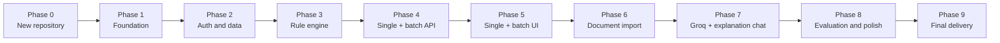

# TrialSync Student Project: Phased Build Plan

> **Historical reference — phases completed.** The instructions, prompts, and progress tracker
> below applied to the original rebuild and are no longer current. Agents must not use this
> document to choose a phase or read it by default. Current work is governed by `AGENTS.md` and
> [`agent-docs/research-extension-implementation-plan.md`](../research-extension-implementation-plan.md).

> Execution companion to `REBUILD_GUIDE.md`. The rebuild guide is the product and architecture specification; this file is the ordered implementation plan.

## 1. How to use this plan

The project should be built as a sequence of independently working milestones. Each phase must leave the repository runnable and tested. Do not ask an agent to build the entire application in one pass.

For Phase 0/1, the implementing agent should read `AGENTS.md` and both planning documents completely. For later phases, use focused context: read `AGENTS.md`, this file's global scope, the current phase, any explicitly referenced `REBUILD_GUIDE.md` sections, the current README/API contracts, and the code/tests being changed. Reread the complete guide only for architecture changes or a final audit.

For every phase:

1. Read the required focused context described above and confirm the phase boundaries.
2. Inspect the current repository and `git status`.
3. Confirm the previous phase's exit criteria still pass.
4. Implement only the current phase.
5. Add tests for the new behavior.
6. Run targeted tests, then all applicable tests and builds.
7. Update README/API documentation when commands or contracts change.
8. Review the diff before committing.
9. Commit the working milestone before starting the next phase.

This focused-context approach reduces repeated token usage. Start a fresh agent thread at a phase boundary when the previous thread has accumulated large logs or unrelated discussion, and hand off using the format in Section 16.

Recommended Git history:

```text
docs: add rebuild specification and phased plan
build: establish project foundation
feat: add authentication and structured records
feat: add deterministic screening engine
feat: add single and batch screening API and history
feat: add complete single and batch frontend workflow
feat: add document import and review
feat: add Groq extraction and grounded explanation chat
test: add end-to-end demo verification
docs: finalize project report and presentation assets
```

## 2. Fixed project scope

### Required stack

- Backend: Python, FastAPI, Pydantic, SQLAlchemy, Alembic.
- Database: PostgreSQL through Docker Compose.
- Frontend: React, TypeScript, Vite.
- Authentication: email/password for demo users.
- Data: fictional synthetic patients, trials, and generated fixture documents only.
- Screening: deterministic Python rule engine.
- Batch screening: bounded synchronous patient × trial matrix using the same rule engine.
- NLP: deterministic extraction baseline plus optional Groq-assisted structured extraction after the manual workflow works.
- Explanation chat: a Groq-backed, screening-scoped conversational assistant with validated criterion/evidence citations, up to 10 persisted messages per screening, refusal behavior, clear history, and canonical-explanation fallback.
- Testing: backend unit/integration tests, frontend tests/build, and one end-to-end flow.

### Required product journey

```text
Register/login
  -> create or import synthetic patient
  -> review patient facts
  -> create or import trial criteria
  -> inspect/edit extracted candidate facts and criteria
  -> review trial rules
  -> run screening
  -> inspect pass/fail/unknown per criterion
  -> inspect evidence and missing information
  -> revisit result in history
  -> select multiple patients and trials
  -> run a bounded screening matrix
  -> compare results and open any matrix cell for evidence
  -> hold a short persisted conversation about an individual stored result
```

### Not part of the semester build

- Real patient data.
- Hospital or EHR integration.
- Billing/subscriptions.
- Enterprise organizations and complex roles.
- HIPAA or clinical-validity claims.
- Microservices, Kubernetes, Redis, or Celery.
- Autonomous eligibility decisions.
- Full reproduction of the reference paper's training pipeline, EHR integration, or clinical-scale ontology.
- A learned decision tree or eligibility classifier that imitates protocol rules.
- Mandatory BioBERT/local-model fine-tuning.
- A general medical, diagnosis, treatment, or enrollment-advice chatbot.

## 3. Phase dependency map



Phase 7 implements the planned NLP enhancement and chatbot, but the deterministic application must remain usable when Groq is disabled or unavailable. BioBERT fine-tuning is optional future work, not a dependency of the finished semester project.

## 4. Phase 0 — Create the clean repository

### Objective

Create a clean Git repository containing only the specifications and initial project metadata. Preserve the original `CTA` repository separately as reference.

### Student actions

From `/home/rinzler/Projects`:

```bash
mkdir TrialSync-v2
cp CTA/REBUILD_GUIDE.md TrialSync-v2/
cp CTA/BUILD_PHASES.md TrialSync-v2/
cp CTA/AGENTS.md TrialSync-v2/
cd TrialSync-v2
git init -b main
git add REBUILD_GUIDE.md BUILD_PHASES.md AGENTS.md
git commit -m "docs: add TrialSync rebuild specification and phased plan"
```

Do not copy the old backend, frontend, lockfiles, caches, logs, or environment files.

### Exit criteria

- `TrialSync-v2` is a separate sibling of `CTA`, not nested inside it.
- `git status` is clean.
- Both planning documents and `AGENTS.md` are committed.
- The original repository remains untouched.

## 5. Phase 1 — Project foundation

### Objective

Produce a clean full-stack skeleton that starts reliably from a fresh clone.

### Backend deliverables

- `backend/pyproject.toml` with pinned or locked dependencies.
- `src/trialsync` package layout.
- FastAPI application factory or clean application module.
- Validated environment settings.
- One SQLAlchemy declarative base.
- Database session dependency.
- Alembic configuration and initial migration.
- `/health/live` and `/health/ready` endpoints.
- Structured error response foundation.
- Test configuration and first health/configuration tests.

### Frontend deliverables

- React + TypeScript + Vite application.
- Application routing skeleton.
- API base URL from environment configuration.
- Shared layout and placeholder pages.
- Test runner, linting/type-checking, and production build scripts.

### Repository deliverables

- Root `.gitignore` covering Python, Node, IDE, `.env`, model, upload, and generated files.
- `.env.example` containing names but no secrets.
- `compose.yaml` with PostgreSQL and health check.
- Root README with exact prerequisites and startup commands.
- Optional task runner/Makefile only if it genuinely simplifies commands.

### Do not implement yet

- User model or JWT logic beyond any minimal placeholder needed for structure.
- Patient/trial models.
- Screening rules.
- PDF parsing.
- Groq or ML packages.

### Required verification

```text
Docker Compose configuration validates.
PostgreSQL becomes healthy.
Alembic upgrades an empty database.
Backend health tests pass.
Backend import does not create tables or download models.
Frontend type check passes.
Frontend tests pass.
Frontend production build passes.
```

### Exit criteria

- A new developer can follow README setup without hidden commands.
- There is exactly one SQLAlchemy Base.
- Schema changes occur only through Alembic.
- No API URL or secret is hard-coded.
- All verification commands pass.

### Suggested commit

```text
build: establish TrialSync project foundation
```

### Agent prompt

```text
Read REBUILD_GUIDE.md and BUILD_PHASES.md completely.

Implement only Phase 1: Project Foundation. Do not implement domain features,
PDF parsing, Groq, BioBERT, or eligibility matching.

Before editing, inspect the repository and propose a concise plan. After
implementation, run all Phase 1 verification commands. Report changed files,
commands, results, and limitations. Stop when Phase 1 exit criteria pass.
```

## 6. Phase 2 — Authentication and structured records

### Objective

Allow demo users to register/login and manage structured synthetic patients and trials.

### Data model

Implement the simplest model that supports the product correctly:

- `User`: ID, email, display name, password hash, timestamps.
- `Patient`: ID, owner/user ID, synthetic external ID, display name, DOB or age basis, sex where relevant, timestamps.
- `PatientFact`: patient ID, type, concept, value/text, unit, assertion, effective date, source label.
- `Trial`: ID, owner/user ID, registry ID, title, condition, phase, timestamps.
- `TrialVersion`: trial ID, version, status (`draft` or `approved`), source text, timestamps.
- `Criterion`: trial-version ID, inclusion/exclusion kind, order, source text, normalized rule JSON, required flag.

If immutable patient snapshots are too large for this phase, define their interface now and implement them in Phase 4 before saved screenings.

### Backend features

- Registration and login.
- Password hashing and token/session handling.
- Current-user endpoint.
- User-owned patient CRUD.
- Patient fact CRUD.
- User-owned trial CRUD.
- Draft trial-version and criterion CRUD.
- Input validation and consistent error responses.
- Pagination or a documented small-demo limit.

Every object lookup must include the current user's ownership constraint. Never query by ID and authorize afterward if the query can be scoped directly.

### Frontend features

- Registration and login pages.
- Session persistence and logout.
- Protected routes.
- Patient list, create, edit, and detail pages.
- Structured conditions, medications, and lab-value editor.
- Trial list, create, edit, and detail pages.
- Inclusion/exclusion criteria editor.
- Loading, empty, validation, and API error states.

### Required tests

- Register, duplicate email, login success, and invalid password.
- Unauthenticated access rejected.
- User A cannot read/update/delete User B's patient or trial.
- Patient fact numeric/unit validation.
- Trial criterion ordering and inclusion/exclusion validation.
- Frontend auth and CRUD happy-path component tests.

### Exit criteria

- Two demo users see only their own records.
- A user can enter all facts needed by the initial golden screening cases.
- A user can create a trial with ordered inclusion and exclusion criteria.
- Database migration works forward from Phase 1.
- Backend and frontend test/build suites pass.

### Suggested commit

```text
feat: add authentication and structured patient and trial records
```

### Agent prompt

```text
Implement only Phase 2 from BUILD_PHASES.md.

Build registration/login, user ownership, structured patient facts, trials,
trial versions, and criteria CRUD. Use synthetic data only. Add migrations,
API tests including cross-user isolation, and the corresponding frontend
workflows. Do not implement screening, PDFs, Groq, or BioBERT.

Preserve every Phase 1 exit criterion. Run the complete applicable suite and
stop after Phase 2 exit criteria pass.
```

## 7. Phase 3 — Deterministic screening engine

### Objective

Implement the core reasoning component: a pure, tested rule engine that never confuses missing evidence with a pass.

### Domain types

- `TruthValue`: `true`, `false`, `unknown`.
- `CriterionResult`: `pass`, `fail`, `unknown`.
- `CriterionKind`: `inclusion`, `exclusion`.
- `OverallState`: `potentially_eligible`, `likely_ineligible`, `needs_review`.
- Typed facts for demographics, diagnoses, medications, and observations.
- Evidence references and missing-information requirements.
- Versioned rule-expression schema.

### MVP operators

- Logical: `and`, `or`, `not`.
- Existence/assertion: `present`, `absent`.
- Numeric: `eq`, `lt`, `lte`, `gt`, `gte`, `between`.
- Concepts: `concept_is`, `concept_in`.
- Temporal: `current`, `within_before` if dates are supported.
- Selection: `latest`, `any`.

Unsupported rules must return `unknown` with reason `UNSUPPORTED_RULE`; they must never fall back to semantic similarity.

### Pure API

```python
screen(patient_snapshot, approved_trial_version, context) -> ScreeningResult
```

The domain package must not import FastAPI, SQLAlchemy, PostgreSQL drivers, Groq, Torch, or the system clock.

### Required behavior

- Inclusion true -> pass; false -> fail; missing/ambiguous -> unknown.
- Exclusion true/triggered -> fail; proven false -> pass; missing/ambiguous -> unknown.
- Any required fail -> `likely_ineligible`.
- All required pass -> `potentially_eligible`.
- Otherwise -> `needs_review`.
- Every criterion returns a reason code, evidence, and missing requirements.
- Canonical explanations are generated from evaluated rules and facts.

### Golden tests

- Ages exactly at, within, and outside boundaries.
- Missing DOB/age.
- HbA1c and eGFR numeric ranges.
- Stale versus current values if temporal rules are included.
- Explicit diagnosis absence versus no diagnosis information.
- Type 1 versus Type 2 diabetes.
- AND/OR/NOT truth tables with unknown.
- Inclusion versus exclusion conversion.
- Unsupported rule.
- Conflicting facts.
- Incompatible units.
- Deterministic repeated result.

### Exit criteria

- The domain tests exhaust rule boundaries and unknown propagation.
- Engine execution requires no database or network.
- Old MiniLM/keyword scoring code is not copied.
- No arbitrary overall confidence percentage is produced.
- Every golden case has expected per-criterion and overall outcomes.

### Suggested commit

```text
feat: add deterministic evidence-based screening engine
```

### Agent prompt

```text
Implement only Phase 3 from BUILD_PHASES.md and Sections 7 and 10 of
REBUILD_GUIDE.md.

Create a pure deterministic rule engine with pass/fail/unknown semantics,
evidence, missing-information reasons, and exhaustive golden tests. It must
have no framework, database, clock, ML, or network dependency. Do not expose
new HTTP routes or build UI in this phase.

Do not use embeddings, keyword similarity, Groq, or BioBERT. Stop only when
all Phase 3 exit criteria and existing suites pass.
```

## 8. Phase 4 — Single and batch screening API with history

### Objective

Connect the pure rule engine to immutable saved inputs and reproducible single/batch screening history.

### Data model additions

- `PatientSnapshot`: immutable copy/version of facts used in a screening.
- `ScreeningBatch`: user, label, pair count, and timestamps. It is a grouping record, not a background job.
- `Screening`: user, optional batch ID, patient snapshot, trial version, state, engine version, timestamps.
- `CriterionEvaluation`: screening, criterion, result, reason, evidence JSON, missing-information JSON.
- Optional `Review`: reviewer/user, disposition, note, timestamp.

### Backend workflow

1. Validate that patient and trial belong to the current user.
2. Require an approved or explicitly selected trial version.
3. Create/reuse an immutable patient snapshot.
4. Execute the pure engine.
5. Save screening and every criterion evaluation transactionally.
6. Return the stored representation.

### Batch workflow

1. Accept unique lists of patient snapshot IDs and approved trial-version IDs.
2. Reject empty input and enforce configured limits: initially 50 patients, 10 trials, and 500 total pairs.
3. Validate ownership and existence of every input before executing anything.
4. Calculate the Cartesian product: each selected patient × each selected trial.
5. Call the same pure `screen()` function for every pair with one engine version and screening timestamp.
6. Save one batch plus one normal screening per pair in a single MVP transaction.
7. Return aggregate counts and linked pair summaries; retain full evidence on ordinary screening detail endpoints.

Do not add a queue or a separate batch-scoring algorithm. Groq is not part of screening execution.

### API

```text
POST /api/v1/screenings
GET  /api/v1/screenings
GET  /api/v1/screenings/{id}
POST /api/v1/screenings/{id}/reviews   # optional but useful
POST /api/v1/screening-batches
GET  /api/v1/screening-batches
GET  /api/v1/screening-batches/{id}
```

### Required tests

- Successful screening persists all evaluations.
- Unknown results and missing information survive JSON round trips.
- A database failure rolls back the entire screening.
- User ownership applies to create/list/detail.
- Historical screening is unchanged after patient/trial edits.
- Repeated inputs with the same engine version produce the same outcome.
- A 20 × 1 batch creates exactly 20 screenings.
- A 3 × 2 batch creates exactly six screenings and correct aggregate counts.
- Duplicate IDs are deduplicated before pair counting and execution.
- Empty, over-limit, nonexistent, and other-user input is rejected before execution.
- An unexpected persistence failure rolls back the entire batch.
- Every batch result is identical to running the same pair through the single endpoint.

### Exit criteria

- A screening is reproducible from its stored snapshot/version metadata.
- History includes pass/fail/unknown counts and overall state.
- No partial screenings exist after errors.
- OpenAPI response matches documented examples.
- Batch creation is bounded, synchronous, deterministic, and reproducible.
- Every batch matrix cell can resolve to an ordinary screening ID with complete evidence.

### Suggested commit

```text
feat: add single and batch screening with reproducible history
```

### Agent prompt

```text
Implement only Phase 4 from BUILD_PHASES.md.

Connect the existing pure engine to immutable patient snapshots, approved
trial versions, transactional screening persistence, criterion evaluations,
and user-owned history endpoints. Add bounded synchronous batch screening for
the Cartesian product of selected patients and trials. Every pair must reuse
the same single-screening function and produce a normal evidence-backed result.
Add migrations and integration tests for counts, limits, ownership, rollback,
and equivalence with individual screening.

Do not change rule semantics and do not add PDFs, Groq, or new ML. Preserve all
previous exit criteria and stop when Phase 4 verification passes.
```

## 9. Phase 5 — Complete single and batch frontend workflow

### Objective

Turn the backend into a polished, presentation-ready application journey.

### Pages and features

- Dashboard with actual counts and recent screenings.
- New screening page selecting a patient and approved trial version.
- Screening result page.
- History page with filters and detail links.
- Batch screening page with patient and trial multi-select.
- Batch pair-count preview and configured-limit validation before submission.
- Batch detail page with patient × trial result matrix.
- Matrix filters for overall state and unknown results.
- Links from every matrix cell to the ordinary evidence-rich screening page.
- Optional client-side CSV export of synthetic batch summaries.
- Patient snapshot/facts summary.
- Trial criteria summary.
- Optional review note/disposition.

### Result page requirements

- Prominent overall state with cautious wording.
- Pass/fail/unknown counts.
- Unknown criteria shown first or easily filterable.
- One row/card per criterion.
- Criterion kind and source text.
- Result, reason, evidence values, units, dates, and source label.
- Missing information needed to resolve unknowns.
- Canonical explanation, not only an AI-written paragraph.
- Clear synthetic-data/educational disclaimer.

### UX requirements

- URL routing and refresh-safe detail pages.
- Responsive common-laptop layout.
- Keyboard focus and basic accessibility.
- Loading skeletons or clear progress indicators.
- Empty states with useful next actions.
- Error states that never masquerade as empty successful data.
- Unknown visually distinct from fail.
- No full token or payload console logging.

### Required tests

- Screening form validation.
- Eligible-like, ineligible-like, and needs-review rendering.
- Unknown criterion evidence/missing-information rendering.
- API failure and session-expiry states.
- History -> detail navigation.
- Batch multi-select and pair-count calculation.
- 3 × 2 result matrix renders six cells with correct states.
- Batch limit/API error rendering.
- Matrix cell -> individual screening detail navigation.
- Frontend optimized build.

### Exit criteria

- The complete manual structured demo journey works in the browser.
- Multiple patients can be screened against one or several trials and compared in one matrix.
- The complete manual structured demo journey works without PDF or Groq features.
- All important backend information is visible and understandable.
- Frontend tests, type checking, linting, and build pass.

### Suggested commit

```text
feat: add complete single and batch screening interface
```

### Agent prompt

```text
Implement only Phase 5 from BUILD_PHASES.md.

Build the complete single and batch frontend screening workflow against the
existing API. Add multi-select, pair-count preview, limits, result matrix,
filters, and links from every matrix cell to the ordinary detailed result.
Prioritize per-criterion evidence and unknown information. Add accessible
loading, empty, error, and session states plus frontend tests.

Do not add PDF extraction, Groq, BioBERT, or change backend rule semantics.
Stop after the manual structured browser journey and all Phase 5 checks pass.
```

## 10. Phase 6 — Text and PDF import with review

### Objective

Allow synthetic records and protocols to be pasted or uploaded while keeping extracted data reviewable.

### Scope

- Pasted text for patient and trial input.
- Text-based PDFs.
- Explicit rejection/message for scanned PDFs if OCR is not implemented.
- Candidate facts/criteria that are editable before approval.
- Page and text-span provenance where available.

### Pipeline

```text
Upload/paste
  -> validate size and type
  -> extract page-aware text
  -> assess extraction quality
  -> deterministic candidate extraction baseline
  -> display candidates and source
  -> user edits/approves
  -> create structured record/version
```

Start with deterministic patterns for demographics, known lab values, comparison operators, units, dates, section headings, and list criteria. Groq belongs to the next phase.

### Required failure behavior

- Empty/malformed/encrypted file -> visible error; no approved record.
- Scanned/low-text PDF -> “OCR not enabled” review/error state.
- Unsupported criterion -> candidate marked for manual rule entry.
- Extraction conflict -> warning; user chooses the accepted value.

### Required tests

- Valid text PDF fixture.
- Empty, corrupt, encrypted, oversized, wrong-type, and scan-like fixtures.
- Page/span preservation.
- Review edits persist exactly.
- Failed import does not create approved data.
- Synthetic fixtures only; no real records in Git.

### Exit criteria

- A demo user can import both sides of a screening from fixture documents.
- Every approved extracted value is reviewable and traceable.
- Parser errors are never silent successes.
- Manual entry remains available when import fails.

### Suggested commit

```text
feat: add reviewed text and PDF import
```

### Agent prompt

```text
Implement only Phase 6 from BUILD_PHASES.md.

Add safe pasted-text and text-based PDF import for synthetic fixtures. Produce
editable candidate facts and criteria with source provenance and explicit
quality/failure states. Reject or clearly flag scanned PDFs because OCR is not
required. Add parser, integration, and UI review tests.

Do not call Groq and do not auto-approve extracted data. Preserve the manual
workflow and stop after Phase 6 exit criteria pass.
```

## 11. Phase 7 — Groq-assisted extraction and conversational explanation chat

### Objective

Add two bounded NLP capabilities without giving the provider decision authority: schema-validated candidate extraction from varied synthetic text, and a short multi-turn conversation about one stored screening's evidence.

### Architecture

Implement separate provider interfaces.

Extraction providers:

- `RuleBasedExtractor` — deterministic baseline.
- `GroqExtractor` — configured hosted structured extractor.
- `MockExtractor` — deterministic test implementation.
- `DisabledExtractor` — explicit no-external-NLP mode.

Explanation providers:

- `CanonicalExplainer` — existing deterministic per-criterion explanations and common summary answers.
- `GroqScreeningChatProvider` — conversational clarification grounded in one server-built screening context.
- `MockScreeningChatProvider` and `DisabledScreeningChatProvider` — deterministic testing and degraded modes.

Neither provider writes approved data, changes criterion results, changes the overall state, or records a reviewer disposition.

### Groq configuration and extraction requirements

- API key and model ID through environment variables.
- Currently supported configured model confirmed through official Groq documentation/account during implementation.
- Strict JSON schema when supported; otherwise local schema validation with at most a bounded retry.
- Low temperature and bounded input/output tokens.
- Required source quotation/offset for every candidate; reject quotations not found in the input.
- Timeouts and bounded `429`/transient retry handling using provider headers where available.
- Record provider, model ID, prompt version, latency, token usage, and validation outcome without logging keys or full synthetic documents.
- No real patient data; synthetic project fixtures only.

### Conversation storage and API contract

Add a `ScreeningChatMessage` table in this phase rather than putting mutable chat text on the immutable `Screening` row. Store `screening_id`, role (`user` or `assistant`), bounded content, assistant answer state, validated citations JSON, provider/model/prompt metadata, and a timezone-aware creation timestamp. Derive ownership from the selected user-owned screening rather than duplicating mutable ownership data on each message. Add a `(screening_id, created_at)` index and role/answer-state constraints in the migration.

Add:

```text
GET    /api/v1/screenings/{id}/conversation
POST   /api/v1/screenings/{id}/conversation/messages
DELETE /api/v1/screenings/{id}/conversation
```

The browser posts only the current `message`; it does not supply trusted conversation history. The backend must authorize and load the screening before constructing context. It reloads the latest 10 persisted messages in chronological order and provides only those messages plus the screening's stored state, criterion evaluations, evidence/missing-information records, and version metadata. The model receives no tools, database access, web search, MCP, code execution, or ability to fetch another record.

The structured response contains:

- `answer_state`: `supported`, `insufficient_evidence`, or `refused`.
- Bounded plain-language `answer`.
- Criterion/evaluation/evidence citations.
- Optional contextual suggested questions.
- Provider/model/prompt-version metadata outside the model-authored answer.

Backend code verifies every citation against the supplied screening context. If an answer lacks valid support, return the safe insufficient-evidence response. Never allow the assistant to provide diagnosis/treatment/enrollment advice, claim clinical validity, reveal another record, change a result, approve evidence, or obey prompt injection embedded in criteria or chat messages.

Keep a configurable default maximum of 10 messages per screening, roughly five user/assistant exchanges. After a valid supported, insufficient-evidence, or refused response, store the user/assistant pair and trim older rows in one transaction. Provider failure must not create a misleading assistant message. `DELETE` clears only chat rows and never changes the screening. Previous messages are untrusted continuity context, never clinical evidence; reload the authoritative screening on every turn. Do not persist hidden prompts, assembled context, API keys, or raw provider payloads. The canonical explanation remains the source of truth and fallback.

### Frontend requirements

- Add an "Explain this result" conversational panel only on saved screening detail pages.
- Provide a few contextual suggested prompts and support follow-up messages.
- Restore the latest persisted messages after refresh and provide a confirmed clear-conversation action.
- Link citations to the referenced criterion rows.
- Distinguish supported, insufficient-evidence, refused, disabled, loading, timeout, rate-limit, and provider-error states.
- State visibly that the assistant explains this stored educational result only and cannot give medical advice or change it.
- Preserve the full structured criterion table and canonical explanation outside the chat panel.

### Required tests

- No real network calls in automated tests.
- Valid and invalid extraction schemas; hallucinated source quotation rejected.
- Valid supported answer with citations.
- Unknown citation ID rejected and converted to safe insufficient-evidence behavior.
- Insufficient-evidence, medical-advice, unrelated, cross-record, and prompt-injection questions.
- Timeout, `429`, provider error, malformed JSON, disabled provider, overlong message, and overlong history.
- User ownership is enforced before context construction.
- Conversation reload, chronological ordering, exact latest-10 trimming, citation persistence, and clear-history behavior.
- Message requests mutate only bounded chat rows and leave screening/review rows unchanged.
- Previous assistant content cannot be promoted to facts or used as criterion evidence.
- Manual extraction, deterministic screening, canonical explanations, and history work during provider failure.

### Exit criteria

- Every Groq extraction candidate requires review and verified provenance.
- Final screening remains deterministic.
- The explanation assistant supports bounded multi-turn conversation only from a selected authorized screening and validated citations.
- Conversation continuity survives refresh, remains within the configured message limit, and can be cleared independently of screening history.
- Unsupported questions fail safely and cannot alter application state.
- The application works completely without `GROQ_API_KEY`, using manual/rule-based extraction and canonical explanations.
- A held-out synthetic fixture report covers extraction quality, answer grounding, citation validity, refusal behavior, latency, and provider failures.

### Suggested commit

```text
feat: add Groq extraction and conversational screening explanations
```

### Agent prompt

```text
Implement only Phase 7 from BUILD_PHASES.md.

Add provider-neutral Groq-assisted candidate extraction plus a screening-scoped
conversational explanation API and UI panel. Persist at most the configured
latest 10 structured messages per screening, restore them after refresh, support
clear history, and never use previous messages as clinical evidence. Enforce
schemas, source quotation and citation validation, authorization-before-context,
bounded history/tokens, refusals, timeouts, rate-limit handling, and deterministic
mocks.

The provider must not approve data, decide/change eligibility, access tools or
other records, or provide medical advice. Manual extraction, canonical
explanations, and deterministic screening must remain usable without an API
key. Add the held-out synthetic evaluation and stop after every Phase 7 exit
criterion passes.
```

## 12. Phase 8 — Evaluation, end-to-end testing, and polish

### Objective

Make the project stable, visually coherent, and defensible during evaluation, including the Groq extraction and explanation-assistant boundaries.

### Engineering work

- End-to-end happy path from registration through screening history.
- End-to-end needs-review path with missing facts.
- End-to-end batch path with multiple patients and multiple trials.
- End-to-end trial-text path: import -> candidates -> reviewer correction/approval -> screening -> evidence.
- End-to-end explanation path: saved screening -> supported message with citations -> follow-up -> refresh/restored history -> citation navigation -> refused unsupported request.
- Backend/frontend full-suite command.
- Database reset and synthetic seed command.
- Clean-clone setup rehearsal.
- Loading/error/empty-state consistency.
- Removal of debug endpoints, token logs, dead code, and stale claims.
- Dependency and secret scan appropriate for a public student repository.
- Basic performance check for fixture-size documents.

### Required NLP evaluation

Use held-out synthetic fixtures to compare deterministic and Groq-assisted candidate extraction when Groq is configured:

1. Candidate precision/recall and exact structured-record accuracy.
2. Invalid schema and source-quotation verification failures.
3. Latency, token/request use, and provider failures.
4. Representative extraction success and human-corrected failure.

Evaluate conversational explanation separately for supported-message accuracy, follow-up consistency, citation precision, unsupported-claim count, refusal accuracy, invalid schema, timeout/rate-limit behavior, persistence/trim behavior, and deterministic fallback. The report must not call this a trained-model evaluation.

### Demo dataset

Include at least:

- One strong potentially eligible case.
- One likely ineligible case caused by an inclusion failure.
- One likely ineligible case caused by an exclusion trigger.
- One needs-review case caused by missing data.
- One Type 1/Type 2 differentiation case.
- One numeric boundary case.
- One PDF import case.
- One batch containing mixed potentially-eligible, likely-ineligible, and needs-review cells.
- One Groq extraction success and one correction case that demonstrate the human-review boundary.
- One short supported explanation conversation with a follow-up and criterion citations.
- One insufficient-evidence and one refused medical-advice/prompt-injection message.

### UI polish

- Consistent TrialSync naming.
- Responsive laptop presentation layout.
- Clear status vocabulary and legend.
- Helpful sample-data action.
- No false “all systems operational” message.
- No unexplained blank screens.
- Educational/synthetic-data disclaimer.
- Evaluation page or clearly linked report showing extraction/conversation fixtures, grounding/memory/refusal results, and limitations without presenting extraction confidence as eligibility confidence.

### Exit criteria

- Full suite and optimized build pass from a clean state.
- Seed/reset/demo commands are documented.
- Demo works with network/Groq disabled using manual extraction and canonical explanations.
- Bounded batch screening completes on the documented synthetic demo size and matches individual results.
- Extraction and explanation-assistant evaluation fixtures, grounding/memory/refusal checks, and provider-failure behavior are documented.
- No known critical or high defect remains open.
- README claims match reproducible behavior.

### Suggested commit

```text
test: complete end-to-end demo verification and polish
```

### Agent prompt

```text
Implement only Phase 8 from BUILD_PHASES.md.

Add end-to-end coverage including Groq-assisted import/review and conversational
screening explanations, held-out synthetic extraction/chat evaluation, demo cases,
clean seed/reset commands, UI polish, and a clean-clone verification path.
Remove debug/dead code and stale claims. Verify the complete offline fallback.
Do not add a new model family or change rule semantics.

Report the complete verification matrix and any remaining known limitations.
Stop after Phase 8 exit criteria pass.
```

## 13. Phase 9 — Final semester delivery

### Objective

Package the working application so an examiner can understand, run, and evaluate it.

### Required documentation

- Root README with screenshots, feature list, architecture, and exact setup.
- `docs/architecture.md` with final data flow and model boundaries.
- `docs/evaluation.md` with golden rule cases, extraction fixtures, conversational grounding/citation/memory/refusal results, latency, and provider failure behavior.
- `docs/limitations.md` with honest limitations and future work.
- API documentation link or checked-in OpenAPI export.
- Synthetic demo credentials/data instructions.

### Report/presentation outline

1. Problem and motivation.
2. Failures learned from the original rushed prototype.
3. Rebuild architecture.
4. Inspiration from eligibility-criteria NLP research and the deliberately smaller scope.
5. Why deterministic code decides while Groq proposes/explains.
6. `pass/fail/unknown` semantics and evidence-based explainability.
7. Groq structured extraction, validation, and human review.
8. Conversational screening explanations, bounded persisted memory, citation validation, refusals, and offline fallback.
9. Live single and batch demonstration.
10. Software, extraction, grounding, and failure-behavior evaluation.
11. Limitations and future work, including optional local biomedical NER research.

### Demonstration script

Prepare and rehearse a short deterministic flow:

1. Start from seeded data.
2. Show one patient and source facts.
3. Import one synthetic trial criterion and show deterministic/Groq candidates, provider metadata, and source quotations.
4. Correct or approve the candidate structure.
5. Run screening.
6. Explain one pass, one fail or unknown, and the evidence.
7. Show history/reproducibility.
8. Run several patients against two trials and show the result matrix.
9. Open one matrix cell and show that it is a normal evidence-backed screening.
10. Ask why one result needs review, send a follow-up, refresh to show persisted memory, follow a citation to the criterion, clear the conversation, then demonstrate a refused medical-advice message.
11. Disable/fail Groq and show that manual entry, screening, history, and canonical explanations still work.

### Final verification checklist

- Fresh clone/setup rehearsal completed.
- No uncommitted changes.
- No `.env`, API keys, uploads, caches, or real data tracked.
- Database migration and seed work.
- Backend tests pass.
- Frontend tests/type checks/build pass.
- End-to-end smoke test passes.
- Screenshots match the current UI.
- Presentation claims match tested behavior.
- Offline/manual fallback is ready for unreliable presentation internet.
- Extraction/conversation evaluation fixtures and results contain synthetic data only and are reproducible with mocks; live Groq evaluation is documented separately when run.

### Suggested commit/tag

```text
docs: finalize TrialSync semester delivery
git tag semester-final
```

## 14. Optional local biomedical NLP extension

This is future work, not a semester completion requirement. If the project is later expanded into a model-development study:

- Define a narrow disease domain, annotation guide, and representative eligibility-criteria corpus.
- Split by source trial/document and check duplicate leakage.
- Compare regex/scispaCy/Groq baselines with one fine-tuned BioBERT-family token classifier.
- Report per-label precision, recall, F1, relation/structured-criterion accuracy, latency, and downstream screening impact.
- Keep all local-model output reviewable and outside the deterministic decision engine.
- Do not add a decision-tree eligibility classifier unless a separate future study has independently labeled outcomes and a defensible research question.

## 15. Progress tracker

Copy this table into the new repository README or project board and update it after each milestone.

| Phase | Status | Evidence | Commit |
|---|---|---|---|
| 0. Clean repository | Not started | Clean Git repository with both specification files and `AGENTS.md` | |
| 1. Foundation | Not started | DB migration, health tests, frontend build | |
| 2. Auth and data | Not started | User isolation and CRUD tests | |
| 3. Rule engine | Not started | Golden rule-engine suite | |
| 4. Single and batch screening API | Not started | Transaction/history/batch equivalence tests | |
| 5. Single and batch frontend | Not started | Manual journey, matrix workflow, and UI tests | |
| 6. Document import | Not started | Parser fixtures and review flow | |
| 7. Groq extraction and explanation chat | Not started | Provider mocks, persistence/citation/refusal tests, offline fallback, fixture evaluation | |
| 8. Evaluation/polish | Not started | End-to-end, grounding/refusal, and clean-clone verification | |
| 9. Final delivery | Not started | Documentation, demo rehearsal, final tag | |

Allowed status values: `Not started`, `In progress`, `Blocked`, `Complete`, or `Skipped (optional)`. The deterministic application must remain usable even if live Groq access is unavailable.

## 16. Agent handoff format

At the end of every agent task, require this response structure:

```text
Phase completed:

Outcome:

Files changed:

Database/API contract changes:

Tests and commands run:

Results:

Known limitations:

Exit criteria not yet satisfied:

Recommended next phase/task:
```

An agent must not call a phase complete because files were generated. Completion means the phase's observable behavior, tests, builds, documentation, and exit criteria all pass.
