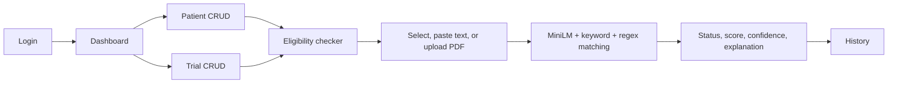
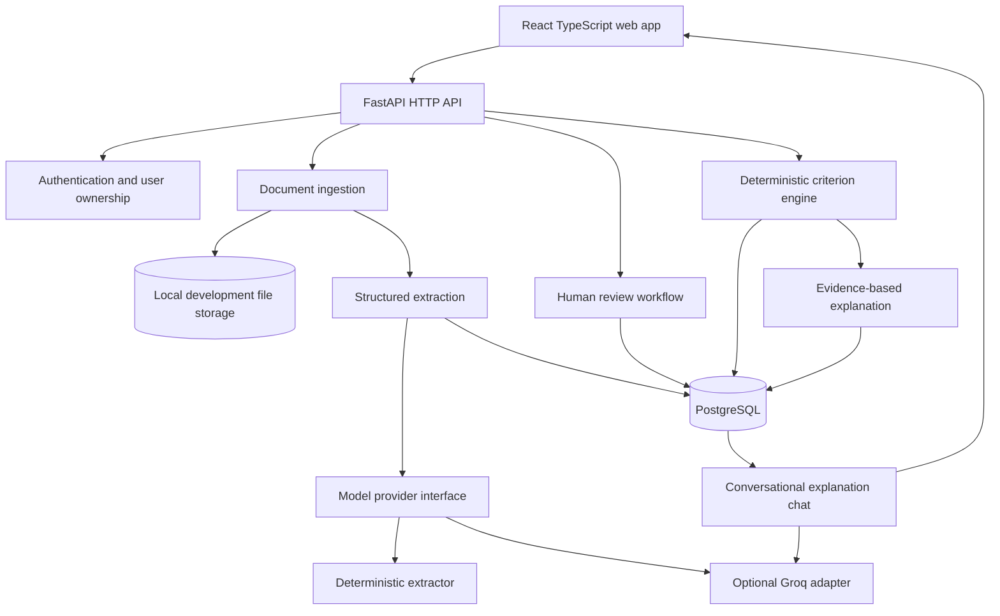
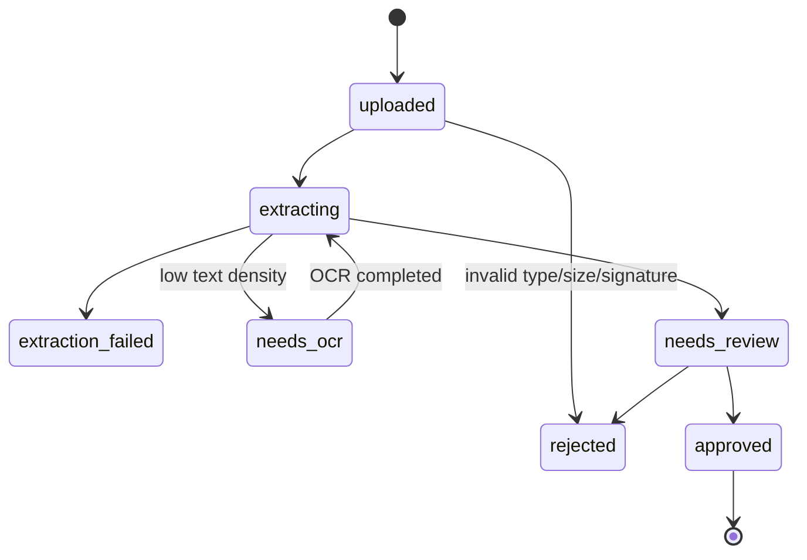

# CTA TrialSync: Student-Project Rebuild Specification

> **Historical reference — completed rebuild.** This document describes the original TrialSync
> rebuild and is not the current implementation plan. Agents must not read or apply it by
> default. Current work is governed by `AGENTS.md` and
> [`agent-docs/research-extension-implementation-plan.md`](../research-extension-implementation-plan.md).
> Consult only a narrowly relevant section when current code and tests do not answer a
> core-product question.

> Repository audit and implementation playbook for rebuilding the semester project as a polished NLP-assisted full-stack application.

| Item | Value |
|---|---|
| Project | CTA TrialSync / ClinSight |
| Audited repository | `CTA`, branch `main`, commit `81e8fade` |
| Audit date | 2026-07-12 |
| Intended audience | The original author, future contributors, and AI coding agents |
| Project level | Semester-project prototype using synthetic data; not a hospital deployment or regulated clinical product |
| Document purpose | Define what to rebuild, why the current version fails, how the replacement should behave, and how to demonstrate that it works |

For the ordered implementation sequence, phase exit criteria, and ready-to-use coding-agent prompts, use the companion [`BUILD_PHASES.md`](BUILD_PHASES.md).

## 1. Executive summary

CTA TrialSync is a student project that demonstrates how software could help pre-screen a patient against a clinical trial protocol. It accepts a synthetic patient record and trial eligibility criteria, extracts structured clinical facts, evaluates every criterion, and presents an evidence-backed result for review.

The product is inspired by work such as Lee et al., ["Optimizing Clinical Trial Eligibility Design Using Natural Language Processing Models and Real-World Data"](https://ai.jmir.org/2024/1/e50800/), but it is not a reproduction of that paper's training pipeline or clinical scale. TrialSync keeps the useful architectural separation: NLP proposes structured information, while deterministic reasoning evaluates approved structures.

The current repository demonstrates the desired user journey, but several foundation-level problems make a clean rebuild safer and faster than incremental repair:

- The application has two independent SQLAlchemy metadata bases. Startup creates tables from the empty one, while application models belong to the other.
- The same `POST /api/eligibility/check` route is registered twice with different behavior and response shapes.
- PDF upload calls an asynchronous `UploadFile.read()` method from synchronous parser code. Parsing can silently return empty text and still create empty database records.
- The matching algorithm treats text similarity as evidence that a clinical rule is satisfied. It does not distinguish a failed rule from missing information.
- Absence of a detected exclusion is counted as if the exclusion was checked and passed. This can inflate both eligibility and confidence.
- The advertised BioBERT, OCR, audit, Docker, Kubernetes, and production capabilities are absent, unused, or only partial.
- There are no automated tests, no real migrations, no deployment definition, and no evaluated NLP dataset.
- Security and privacy controls are not suitable for identifiable health data.

The replacement should be presented as an educational pre-screening prototype, not an autonomous enrollment decision maker. Its core invariant is:

> No criterion is allowed to pass merely because matching text was not found. Every result must be `pass`, `fail`, or `unknown`, backed by source evidence and a deterministic rule evaluation.

The recommended architecture is a bounded NLP-assisted pipeline:

1. Deterministic code handles document validation, normalized facts, units, dates, Boolean criterion logic, final status, and the canonical explanation.
2. Deterministic parsers extract well-defined headings, demographics, dates, quantities, operators, and units.
3. An optional configured Groq model converts difficult synthetic prose into schema-validated candidate facts and criteria with verifiable source quotations.
4. The demo user reviews and approves all extracted facts and parsed trial criteria before screening.
5. A bounded Groq explanation assistant may answer follow-up questions about one stored screening using only its criterion results, evidence, and missing-information records.

The goal is a convincing, well-engineered semester demonstration: reliable local setup, a polished UI, explainable results, synthetic fixtures, automated tests, optional Groq-assisted extraction, and grounded conversational explanation chat. Enterprise multi-tenancy, billing, hospital integration, and regulatory compliance are outside the implementation scope.

## 2. Product definition

### 2.1 Problem statement

Clinical trial pre-screening requires comparing many patient facts with long inclusion and exclusion criteria. Manual review is slow and inconsistent. TrialSync should organize that comparison, surface relevant evidence, and make missing information obvious.

### 2.2 Intended users

- The student presenting and maintaining the project.
- Faculty, examiners, and classmates evaluating the demonstration.
- A demo user acting as a research coordinator while entering patients and protocols.
- Developers or AI agents extending and testing the project.

### 2.3 Intended outcome

Given one patient snapshot and one approved version of a trial protocol, the system produces:

- A pre-screening state: `potentially_eligible`, `likely_ineligible`, or `needs_review`.
- One evaluation for every atomic criterion.
- The patient facts and source spans used for each evaluation.
- Missing facts required to resolve unknown criteria.
- Extraction quality and data-completeness indicators.
- An immutable record of protocol version, patient snapshot, engine version, model version, and reviewer actions.

The same engine must also support a bounded batch matrix: many selected patient snapshots against one trial, or many selected patients against many trial versions. A batch is a convenience wrapper around the same reproducible single-pair screening operation, not a separate scoring algorithm.

Use cautious status names. Avoid presenting `eligible` as a final enrollment decision. The final decision belongs to qualified trial staff working from the approved protocol and original source record.

### 2.4 Minimum viable product

The MVP must support:

1. Email/password registration and sign-in for demo users.
2. Manual creation and editing of structured patient facts.
3. Manual creation and editing of a trial and its atomic criteria.
4. Text and text-based PDF import with a review-before-save step.
5. Deterministic evaluation of age, sex where relevant, diagnoses, medications, and a small configured set of laboratory values.
6. Per-criterion `pass / fail / unknown` results with evidence.
7. Screening history and a detailed result page.
8. Batch screening for multiple patients against one or more trials, with a result matrix and summary.
9. A screening-scoped explanation chatbot that answers from stored evidence, cites the relevant criteria, and refuses unsupported or medical-advice questions.
10. Synthetic demo data and an automated test suite.

### 2.5 Explicit non-goals for the MVP

- Automatic enrollment or medical advice.
- Support for every possible natural-language eligibility expression.
- Silent interpretation of arbitrary scans, handwritten notes, tables, or images.
- EHR or hospital-system integration.
- Reproducing the paper's thousands of trials, EHR integration, ontology breadth, or clinical claims.
- Training an eligibility classifier or decision tree merely to imitate deterministic protocol rules.
- Mandatory BioBERT or other local-model fine-tuning.
- A general-purpose medical chatbot, diagnosis assistant, treatment recommender, or autonomous trial-enrollment assistant.
- Regulatory, medical-device, or HIPAA compliance claims.
- Subscriptions, billing, enterprise organizations, or complex role management.
- Kubernetes, microservices, or high-availability infrastructure.
- A single opaque “confidence” percentage pretending to be a calibrated probability of eligibility.

## 3. What exists in the current repository

### 3.1 Repository map

```text
CTA/
├── README.md                         # Short claims; incomplete setup
├── package.json                      # Only react-markdown; not an app workspace
├── backend/
│   ├── requirements.txt              # FastAPI, ML, PDF, DB, auth, queue dependencies
│   ├── seed_data.py                  # Synthetic patients/trials and expected pairs
│   ├── migrate_fk_cascade.py         # One-off manual PostgreSQL migration
│   └── app/
│       ├── main.py                   # FastAPI assembly and CORS
│       ├── database.py               # Engine, session, one declarative Base
│       ├── models.py                 # Models on a second declarative Base
│       ├── schemas.py                # Response/request schemas
│       ├── api/
│       │   ├── auth.py               # JWT authentication
│       │   ├── routes.py             # CRUD plus one eligibility route
│       │   └── eligibility.py        # A second eligibility route
│       └── services/
│           ├── document_parser.py    # pdfminer and regex extraction
│           ├── nlp_engine.py         # MiniLM embeddings and optional scispaCy
│           ├── matching_engine.py    # Similarity/keyword/numeric heuristics
│           ├── explainability.py     # Markdown narrative templates
│           └── audit_service.py      # DB helpers plus console-only wrapper
└── web_dashboard/
    └── src/
        ├── App.js                    # Auth shell, navigation, embedded history
        ├── components/               # Dashboard, checker, patient/trial CRUD
        └── services/                 # Hard-coded localhost fetch clients
```

### 3.2 Current user flow



This flow is a useful UI prototype. The data contracts and decision pipeline beneath it need replacement.

## 4. Evidence-based audit of the current implementation

### 4.1 Severity guide

- **Critical:** Can prevent startup, corrupt the decision, expose sensitive data, or invalidate the system’s main claim.
- **High:** Breaks an important workflow or makes results unreliable.
- **Medium:** Creates maintenance, UX, observability, or scalability problems.
- **Low:** Cleanup or consistency issue that should not drive architecture.

### 4.2 Critical and high findings

| Severity | Finding | Repository evidence | Consequence | Rebuild response |
|---|---|---|---|---|
| Critical | Two unrelated SQLAlchemy `Base` objects | `app/database.py` and `app/models.py` each call `declarative_base()` | `Base.metadata.create_all()` in `main.py` can create no model tables | Define one base in the DB package; use Alembic only for schema changes |
| Critical | Duplicate eligibility endpoint | `routes.py` and `eligibility.py` both register `POST /api/eligibility/check` | Router order determines behavior; documentation shows duplicate operations; responses and persistence differ | One router and one command handler per operation |
| Critical | PDF upload uses async file object synchronously | `extract_from_pdf()` calls `pdf_file.read()` without `await` | A coroutine can be passed to `BytesIO`; error becomes empty text; empty records may be saved | Read/validate bytes in the API layer, then pass bytes to a pure parser that fails explicitly |
| Critical | Missing evidence is treated as a pass | Exclusion confidence counts every non-triggered exclusion as “addressed” | Missing pregnancy, ECG, pathology, lab, or history data can increase eligibility/confidence | Three-valued criterion evaluation with conservative `unknown` |
| Critical | Similarity is used as rule truth | Full patient summary is embedded against each criterion | A semantically related statement may be opposite, historical, negated, or outside a time window | Parse criteria into typed rules and evaluate normalized facts deterministically |
| Critical | Unsafe handling even for a public demo | Hard-coded secrets/default DB password and full token logging | Credentials or demo data can be exposed | Use environment variables, remove token logging, and use synthetic records only |
| High | Model loads during module import | `nlp_engine = NLPEngine()` immediately creates `SentenceTransformer` | Startup depends on model availability/download and can block or crash | Lazy, explicit model lifecycle; health/readiness states; offline cache |
| High | Claimed BioBERT is unused | Config contains a BioBERT name; runtime uses `all-MiniLM-L6-v2` | README misrepresents implementation | Document exact model/task/version and evaluate it |
| High | OCR is not implemented | OCR dependencies/settings exist; parser only uses pdfminer | Scanned PDFs return no useful text | Add OCR as a separate stage with quality checks, or reject scans in MVP |
| High | Claimed audit trail is console-only | `AuditService.log_check()` creates a dict then logs it | The advertised history/audit feature is misleading | Keep reproducible screening history; list enterprise audit logging as future work |
| High | Errors are swallowed or mislabeled | PDF parser returns `""`; `/checks` returns `[]` on DB error; second eligibility route converts all exceptions to 500 | UI can show empty success states while the system is broken | Typed domain errors, correct HTTP status, rollback, trace ID, safe user messages |
| High | No automated test suite | Repository has zero `test_*.py` files and no frontend tests | Expected seed outcomes are comments, not executable guarantees | Build unit, integration, golden extraction, and end-to-end tests from day one |
| High | Numeric logic is incomplete and contains defects | Only age/HbA1c/BMI/eGFR are partial; BMI exclusion reads nonexistent regex group 2 | Runtime error or wrong evaluation for common rules | Typed operators, quantity/unit library, parameterized rule tests |
| High | No protocol or patient version snapshot | Eligibility rows reference mutable/deletable records | A historical result can no longer be reproduced | Immutable patient snapshot and trial-version IDs on every screening |

### 4.3 API and database findings

- `main.py` performs schema creation at import time. Application import should not mutate the database schema.
- The default database points at the general `postgres` database with a committed password.
- Alembic is listed but not configured. A manual PostgreSQL-only migration edits foreign keys outside a revision history.
- IDs such as `MRN{user}{global count + 1}` are predictable, race-prone, and globally unique in the wrong way.
- `Patient.mrn` and `Trial.trial_id` are globally unique rather than scoped to a demo user.
- JSON and PostgreSQL `ARRAY` fields are mixed without a clear portability or indexing strategy.
- Models lack user-ownership constraints, useful indexes, relationships, check constraints, and timezone-aware timestamps.
- Deleting a patient/trial nulls history references, while no immutable label/snapshot remains to explain the result.
- Schemas are duplicated inside route modules and `schemas.py`.
- Mutable list/dict defaults appear throughout Pydantic models. Use `default_factory`.
- `EligibilityCheckResponse` aliases database `id` to `check_id`, while the frontend reads `c.id`.
- `overall_score` uses a 0–1 scale while `confidence_score` uses 0–100. This is easy to misuse.
- The global exception handler returns a dict rather than a proper response and exposes raw exception text.
- Blocking model inference runs inside an async HTTP request, blocking the event loop.
- The debug endpoint is in the main authenticated API instead of a development-only diagnostic surface.

### 4.4 NLP and clinical-logic findings

- General-purpose MiniLM sentence similarity is not a biomedical NER system.
- scispaCy is optional, but its small scientific model finds broad biomedical spans; it does not automatically classify all spans into diagnoses versus drugs. The code reclassifies them using small hard-coded lists.
- Substring synonym expansion can conflate concepts. Adding generic “diabetes” to Type 2 diabetes increases Type 1/Type 2 confusion.
- Patient extraction has no negation detection: “no history of asthma” may yield asthma.
- It has no experiencer detection: family history can become the patient’s condition.
- It has no temporality: resolved disease, recent events, “within six months,” and current therapy cannot be evaluated reliably.
- It has no assertion certainty: suspected, ruled-out, and confirmed diagnoses are equivalent.
- Lab extraction lacks collection date, unit normalization, reference range, abnormal flag, duplicate values, and latest-value selection.
- DOB-based age uses years only and ignores whether the birthday has occurred.
- Gender extraction reduces values to Male/Female and can match incidental words in the document.
- Trial section parsing assumes recognizable English headings and simple lists. Nested AND/OR groups become flat strings.
- Inclusion scoring records only matched criteria. It cannot explain which mandatory criteria failed or were unknown.
- A numeric failure returns score zero, which is indistinguishable from “no numeric check possible.” Semantic similarity can then override the failed numeric constraint.
- Hard-coded exclusion vetoes cover a few diseases, making behavior depend on vocabulary rather than rule semantics.
- The overall score and confidence formulas are hand-selected and not calibrated against labeled screening decisions.
- Explanations describe “ML-generated” conclusions more strongly than the underlying evidence supports.

### 4.5 Frontend findings

- The API base URL is hard-coded to `http://localhost:8000/api` in multiple files.
- API debug code logs the full bearer token to the browser console.
- Registration exists in the API client but is not exposed in the active UI.
- Navigation is component state, not real routing; refresh/deep links do not preserve a page.
- Error handling commonly logs and shows an empty state. The dashboard can still say “All systems operational.”
- Patient manual entry cannot add lab values, dates, units, or evidence—the most important deterministic screening inputs.
- The result page hides the structured per-criterion evidence inside a long generated narrative.
- History has no details/review action and styles every non-eligible state as red, including uncertainty.
- Fixed two-column layouts and sticky sidebar are not meaningfully responsive.
- Large inline style blocks and duplicate/dead theme/navigation/model files raise maintenance cost.
- There are no component, accessibility, or end-to-end tests.

### 4.6 Documentation and delivery findings

- The root README says “production-ready,” BioBERT, Flutter, Docker, and Kubernetes. None is demonstrated by the repository.
- Setup omits PostgreSQL creation, environment variables, model download, scispaCy model install, migrations, seed credentials, backend command, and troubleshooting.
- Root and backend `package.json` files are unrelated fragments.
- No Dockerfile, Compose file, Kubernetes manifests, CI workflow, API contract export, or release process exists.
- The repository contains generated `__pycache__` files and a seed log.

### 4.7 Verification performed during this audit

- All Python source files passed syntax compilation.
- Backend import could not be tested because the active environment lacks FastAPI and the declared dependencies.
- Frontend build could not be tested because `node_modules`/`react-scripts` are not installed.
- No automated tests were found.
- No Docker, Compose, Alembic configuration/revisions, or test directories were found.
- The audit did not install dependencies, connect to the configured database, or send patient data to an external model.

These are environment-aware observations, not proof that dependency installation itself will fail.

## 5. Rebuild principles and invariants

Every implementation decision should preserve these rules:

1. **Human-in-the-loop:** the system performs pre-screening and never silently enrolls or rejects a patient.
2. **Unknown is first-class:** missing, stale, ambiguous, or conflicting evidence yields `unknown`.
3. **Rules decide; models propose:** models may extract candidate structures, but deterministic code evaluates approved rules.
4. **Evidence before prose:** every result stores source fact IDs and document spans before generating an explanation.
5. **Immutable screening inputs:** protocol version, patient snapshot, engine version, and model configuration cannot change underneath a saved result.
6. **No silent parser success:** empty or low-quality extraction is an error or a review-required state.
7. **User ownership:** every patient, trial, and screening query is scoped to the signed-in user.
8. **Provider portability:** Groq or any LLM vendor is an adapter, not a domain dependency.
9. **Reproducibility:** the same approved facts, rules, and engine version produce the same criterion outcomes.
10. **Measurable quality:** evaluate every configured NLP provider on held-out synthetic fixtures; do not adopt it merely because its output sounds biomedical.
11. **Assistant grounding:** explanation chat is assembled from one authorized stored screening and may not invent facts, change outcomes, or answer beyond that evidence.
12. **Graceful degradation:** manual entry, canonical explanations, and screening remain fully usable without Groq.

## 6. Target architecture

### 6.1 Recommended modular monolith

Use a modular monolith. It is simple enough to finish within a semester while still demonstrating good boundaries.



Recommended technology categories:

- Web: React + TypeScript, a maintained build tool, real URL routing, schema-generated API client, and a tested component system.
- API: FastAPI + Pydantic + SQLAlchemy + Alembic.
- Data: PostgreSQL. Use SQLite only for isolated pure tests if database-specific types are avoided.
- Documents: local filesystem for the semester demo behind a small storage interface.
- Jobs: process small text synchronously. A background queue is future work, not a semester requirement.
- Models: provider-neutral Python interfaces with a deterministic mock implementation for tests.
- Operations: Docker Compose for reproducible local development. An optional demo deployment may be added near the end.

Do not add Redis, Celery, Kubernetes, a vector database, microservices, billing, or enterprise administration to the semester build.

### 6.2 Suggested source layout

```text
trialsync/
├── README.md
├── compose.yaml
├── .env.example
├── docs/
│   ├── architecture.md
│   ├── clinical-safety.md
│   ├── data-dictionary.md
│   └── evaluation.md
├── backend/
│   ├── pyproject.toml
│   ├── alembic.ini
│   ├── migrations/
│   ├── src/trialsync/
│   │   ├── main.py
│   │   ├── config.py
│   │   ├── db/
│   │   ├── auth/
│   │   ├── patients/
│   │   ├── trials/
│   │   ├── documents/
│   │   ├── extraction/
│   │   ├── screening/
│   │   └── api/
│   └── tests/
│       ├── unit/
│       ├── integration/
│       ├── golden/
│       └── fixtures/
└── web/
    ├── package.json
    ├── src/
    │   ├── app/
    │   ├── api/
    │   ├── features/
    │   ├── components/
    │   └── test/
    └── e2e/
```

Keep dependencies pointing inward:

```text
HTTP/UI adapters -> application use cases -> domain rules
                   infrastructure adapters -> DB/storage/model providers
```

The domain rule engine must be importable and testable without FastAPI, PostgreSQL, Torch, or an API key.

## 7. Domain model and data design

### 7.1 Core entities

| Entity | Purpose | Important fields |
|---|---|---|
| `users` | Authenticated demo user | `id`, normalized `email`, `password_hash`, `display_name`, `created_at` |
| `patients` | User-owned synthetic patient identity | `user_id`, opaque `external_id`, display label, lifecycle state |
| `patient_snapshots` | Immutable facts at screening time | `patient_id`, `version`, `as_of`, `created_by`, `source_summary` |
| `patient_facts` | Typed, normalized clinical facts | snapshot, type, code system/code, value, unit, assertion, effective time, provenance |
| `documents` | Uploaded source metadata | owner, type, storage key, checksum, MIME, size, extraction status, quality |
| `document_spans` | Page/character provenance | document, page, start/end, exact text, bounding box if available |
| `trials` | User-owned trial identity | `user_id`, registry ID, title, condition, source |
| `trial_versions` | Immutable protocol revision | trial, version, effective date, source document, approval status |
| `criteria` | Atomic inclusion/exclusion rule | trial version, order, kind, original text, normalized expression, required flag |
| `screenings` | Immutable screening run | patient snapshot, trial version, engine/model versions, overall state, timestamps |
| `screening_batches` | Bounded grouping of patient × trial runs | user, label, pair count, timestamps |
| `criterion_evaluations` | Per-rule result | criterion, result, reason code, evidence facts/spans, missing requirements |
| `screening_chat_messages` | Bounded conversational memory for one screening | screening, role, content, answer state, citations, provider metadata, created at |
| `reviews` | Human disposition | screening, reviewer, decision, notes, timestamp |
| `activity_events` | Optional demo activity/history feed | user, action, resource label, timestamp |

Evaluation fixtures and provider-comparison reports belong in versioned project files rather than the application database. Runtime extraction metadata should record the extractor/provider name, configured model identifier when applicable, prompt/schema version, and confidence or review flags needed to reproduce how a candidate was produced.

### 7.2 Patient fact structure

A patient is not a bag of strings. Store facts with context:

```json
{
  "fact_type": "observation",
  "concept": {
    "system": "local-or-loinc",
    "code": "hba1c",
    "display": "Hemoglobin A1c"
  },
  "value": 8.2,
  "unit": "%",
  "assertion": "present",
  "effective_at": "2026-06-28T09:30:00Z",
  "source": {
    "document_id": "...",
    "span_id": "...",
    "page": 2,
    "text": "HbA1c 8.2 %"
  },
  "extraction": {
    "method": "human|regex|ner|llm",
    "model_version": "...",
    "score": 0.97,
    "review_state": "approved"
  }
}
```

For diagnoses and medications, also store:

- `assertion`: `present`, `absent`, `possible`, `conditional`.
- `temporality`: `current`, `historical`, `resolved`, `unknown`.
- `experiencer`: `patient`, `family`, `other`.
- Effective start/end dates when known.
- Original text and normalized concept independently.

Never overwrite source text with normalized text.

### 7.3 Trial criterion representation

Keep both the immutable source sentence and a computable expression. A small JSON DSL is enough for the MVP:

```json
{
  "criterion_kind": "inclusion",
  "required": true,
  "source_text": "Age 18 to 75 years at screening",
  "expression": {
    "op": "between",
    "fact": "demographic.age",
    "min": 18,
    "max": 75,
    "unit": "year",
    "as_of": "screening_date"
  }
}
```

```json
{
  "criterion_kind": "exclusion",
  "required": true,
  "source_text": "eGFR < 30 mL/min/1.73m2 within 30 days before screening",
  "expression": {
    "op": "and",
    "args": [
      {
        "op": "lt",
        "fact": "observation.egfr",
        "value": 30,
        "unit": "mL/min/1.73m2",
        "selection": "latest"
      },
      {
        "op": "within_before",
        "days": 30,
        "anchor": "screening_date"
      }
    ]
  }
}
```

Supported MVP operators should be deliberately small:

- Logical: `and`, `or`, `not`.
- Existence/assertion: `present`, `absent`.
- Numeric: `eq`, `lt`, `lte`, `gt`, `gte`, `between`.
- Set/text concept: `concept_is`, `concept_in`.
- Temporal: `current`, `before`, `after`, `within_before`, `duration_gte`.
- Selection: `latest`, `earliest`, `any`, `all`.

Unsupported expressions remain source text with parse state `needs_manual_rule`. Do not approximate them with similarity and call them evaluated.

### 7.4 Criterion semantics

Use the same result vocabulary for both kinds:

| Criterion kind | `pass` means | `fail` means | `unknown` means |
|---|---|---|---|
| Inclusion | Required inclusion condition is proven true | Required inclusion condition is proven false | Evidence is missing, stale, ambiguous, or the rule is unsupported |
| Exclusion | Disqualifying condition is proven false | Disqualifying condition is proven true/triggered | Evidence is missing, stale, ambiguous, or the rule is unsupported |

Overall state:

```text
if any required criterion == fail:
    likely_ineligible
else if all required criteria == pass:
    potentially_eligible
else:
    needs_review
```

This policy is simple, auditable, and conservative. If a study has protocol-specific precedence or waivable criteria, model that explicitly rather than changing global thresholds.

### 7.5 Score design

Do not create one “confidence of eligibility” number from arbitrary weights. Display separate, interpretable measures:

- **Criteria completion:** required criteria with `pass` or `fail` divided by required criteria.
- **Source coverage:** evaluations linked to at least one source span divided by resolved evaluations.
- **Extraction quality:** validated model/extractor confidence summary, clearly labeled as extraction—not clinical—confidence.
- **Unknown count:** unresolved required criteria.
- **Human review state:** unreviewed, reviewed, accepted, overridden.

If the project later needs a probability, train and calibrate it on an independent labeled screening dataset and report calibration error, not just accuracy.

## 8. Document ingestion and extraction pipeline

### 8.1 State machine



### 8.2 Upload requirements

At the API boundary:

1. Stream bytes with a hard size limit.
2. Validate filename only for display; generate the storage key server-side.
3. Validate content signature and MIME type, not just extension.
4. Compute SHA-256 for duplicate detection and immutable identification.
5. Store the original separately from extracted text.
6. Reject encrypted, malformed, empty, or unsupported files clearly.
7. Never log document text, patient name, or bearer token.

The parser receives `bytes`, not a framework upload object:

```python
class PdfTextExtractor(Protocol):
    def extract(self, content: bytes) -> ExtractedDocument: ...
```

### 8.3 Text extraction

- Preserve pages and character offsets.
- Calculate text density and printable-character quality.
- Preserve medically meaningful symbols (`<`, `>`, `≤`, `≥`, `%`, `/`).
- Detect common table/layout failure rather than silently flattening it.
- In the MVP, reject scanned PDFs with “OCR not enabled” if OCR is not implemented.
- If OCR is implemented, store OCR engine/version and page-level quality.

### 8.4 Patient extraction

Use multiple extractors and merge candidates:

1. Deterministic patterns for well-defined demographics, dates, quantities, and units.
2. Optional scispaCy or another evaluated lightweight biomedical pipeline for candidate diagnosis, drug, procedure, and observation spans.
3. Assertion detection for negation, experiencer, uncertainty, and temporality.
4. Optional LLM structured extraction for complex prose.
5. Schema validation, unit normalization, duplicate resolution, and conflict flags.
6. Human confirmation before candidate facts become an approved snapshot.

The extraction API should return candidates and warnings, not a silently accepted patient.

### 8.5 Trial extraction

1. Identify inclusion/exclusion section boundaries by page and heading.
2. Preserve numbering, bullets, indentation, and nested structure.
3. Use deterministic patterns for obvious values, units, comparison operators, temporal phrases, and negation.
4. Optionally ask the configured Groq extractor to propose difficult entity relationships and compound criterion structure using strict schemas and source quotations.
5. Split compound sentences only when logical relationships are preserved.
6. Produce candidate entity-attribute-value records, atomic criteria, and DSL expressions.
7. Mark unsupported or ambiguous statements for manual rule authoring.
8. Require a reviewer to approve a trial version before screening.

Example ambiguity:

```text
Age 18–65 with T2DM and HbA1c 7–10%, unless receiving insulin for less
than 12 weeks or having changed dose within 30 days.
```

Flattening this into keywords destroys its logic. The UI must let a reviewer correct the parsed tree.

## 9. NLP and Groq strategy

### 9.1 Direct answer

Use deterministic parsing where the syntax is well defined, Groq where varied synthetic prose benefits from structured language understanding, and neither for the final deterministic rule decision. BioBERT fine-tuning is optional future research, not a completion requirement.

| Job | Best starting approach | Why |
|---|---|---|
| PDF text extraction | PDF parser, then OCR if needed | This is document processing, not NER |
| Numeric labs/dates/units | Regex/parser + unit normalization | Deterministic and easy to test |
| Biomedical entity spans | Regex/terminology tables and optional scispaCy | Local, repeatable candidate extraction |
| Compound criterion parsing | Configured Groq instruction model with strict JSON schema + human review | LLMs handle varied language, but need validation |
| Criterion truth | Deterministic DSL evaluator | Reproducible and handles unknown explicitly |
| Canonical explanation | Deterministic evidence template | Reproducible source of truth |
| Conversational explanation | Screening-scoped Groq assistant grounded in stored evaluations and bounded recent messages | Natural multi-turn clarification without giving the model decision authority |

### 9.2 Groq-assisted candidate extraction

A Groq-hosted instruction model can improve candidate extraction from varied synthetic text. Groq documents chat completions and JSON-schema structured outputs for selected models. However:

- Free-plan requests, tokens, and daily usage are limited and may differ by model/account.
- Model availability and deprecation change over time.
- Strict structured output is supported only by selected models.
- A network/provider outage must not corrupt or partially save a record.
- Hosted models may receive only synthetic fixture text for this project. A free API key is not permission to upload real patient records.

Implementation rules:

```python
class StructuredExtractor(Protocol):
    async def extract_patient_facts(
        self, text: str, schema_version: str
    ) -> ExtractionResult: ...

    async def parse_trial_criteria(
        self, text: str, schema_version: str
    ) -> TrialParseResult: ...
```

- Select model IDs through configuration, never hard-code them into domain code.
- Use strict JSON schema where the chosen model supports it; otherwise validate and retry at most a bounded number of times.
- Set temperature low for extraction.
- Require source quotes and offsets for every proposed fact; verify quotes exist in the supplied text.
- Reject unknown fields (`additionalProperties: false`).
- Apply timeouts, bounded exponential backoff, and 429 handling.
- Cache by redacted-text checksum + prompt version + model ID where policy permits.
- Record provider, model ID, prompt version, latency, and validation outcome—never the API key or full input document in logs.
- Provide `MockExtractor` and `RuleBasedExtractor` so tests and local development require no API.
- Do not automatically fall back from a failed model to a weaker one without recording the change.

For coursework, never send real patient records to the hosted provider. Use synthetic fixtures only.

### 9.3 Grounded explanation assistant

The assistant is a conversational view over one existing screening, not a fixed FAQ and not a second screening engine. It supports short multi-turn exchanges such as asking for a simpler explanation and then asking which evidence supports it. The authenticated route loads the selected screening and constructs a bounded context containing only:

- Overall stored state and pass/fail/unknown counts.
- Criterion IDs, kinds, immutable source text, stored result, and reason code.
- Evidence fact IDs, approved values, units, effective dates, and source labels/spans already attached to each evaluation.
- Missing-information requirements for unknown criteria.
- Engine, patient-snapshot, and trial-version metadata useful for explaining reproducibility.

Do not expose a generic database query tool, web search, MCP server, code execution, or write capability. Do not allow the model to fetch other patients/trials or update reviews. Treat the user message, source text, and previous messages as untrusted delimited data.

The provider must return a schema such as:

```json
{
  "answer_state": "supported",
  "answer": "This screening needs review because two required criteria lack current evidence.",
  "citations": [
    {
      "criterion_id": "criterion-7",
      "evaluation_id": "evaluation-7",
      "evidence_ids": [],
      "label": "Recent eGFR is missing"
    }
  ],
  "suggested_questions": [
    "Which criteria passed?",
    "What information is still missing?"
  ]
}
```

Allowed `answer_state` values are `supported`, `insufficient_evidence`, and `refused`. The backend rejects citations that do not exist in the supplied context. If no valid citation supports the answer, it returns the safe insufficient-evidence response instead of the generated claim.

Supported questions include:

- Why is this result `needs_review`?
- Which criterion failed, and what stored fact triggered it?
- What information is missing for an unknown criterion?
- What is the difference between extraction quality and eligibility?
- Why would editing the patient create a new snapshot rather than change this history?

The assistant must refuse or redirect:

- Should this patient enroll or take a treatment?
- What diagnosis does the patient have beyond the approved facts?
- Are these results medically safe or clinically validated?
- Questions about a different patient/trial, unrelated health topics, or facts absent from the stored screening.
- Requests to ignore instructions, change a result, approve evidence, reveal prompts, or expose other records.

#### Persisted conversational memory

Groq chat requests are stateless. For continuity across page refreshes and later logins, persist a small server-owned history in `screening_chat_messages` rather than asking the browser to resend trusted history or adding a mutable text field to `screenings`.

Each row stores:

- `id` and `screening_id`; ownership is derived from the user-owned screening.
- `role`: `user` or `assistant`.
- Bounded plain-text `content`.
- Assistant-only `answer_state`, validated citation JSON, provider/model ID, and prompt version.
- A timezone-aware `created_at` timestamp.

Use a configurable default retention of the latest 10 messages per screening, equivalent to roughly five user/assistant exchanges. Load them in chronological order when the panel opens and before each new provider request. On a successful assistant response—including a valid refusal or insufficient-evidence response—save the user and assistant messages and trim older rows in one transaction. A provider timeout or invalid response must not create a misleading assistant message. Provide an authenticated clear-conversation operation.

Previous messages exist only for conversational continuity. They are not patient facts, criterion evidence, reviewer decisions, or a source of truth. Every turn must reload the immutable screening and its evaluations, and the backend must validate new citations against that authoritative context. Do not persist the hidden system prompt, the assembled provider context, API keys, or raw provider payloads.

Enforce message/output length limits, per-user throttling, provider timeouts, bounded 429 retry handling, and a visible disabled/degraded state. Canonical explanations remain available when Groq fails.

### 9.4 Explainability architecture

Do not ask any model, including BioBERT, to invent why a decision happened. Build an evidence graph during evaluation:

```json
{
  "criterion_id": "inc-03",
  "result": "pass",
  "reason_code": "NUMERIC_RANGE_SATISFIED",
  "rule": "7.0 <= hba1c <= 10.0",
  "facts": [
    {
      "value": 8.2,
      "unit": "%",
      "effective_at": "2026-06-28",
      "source_span": "HbA1c 8.2 %"
    }
  ]
}
```

Canonical explanation:

```text
PASS — HbA1c is 8.2% (collected 28 Jun 2026), which is within the required
7.0%–10.0% range. Source: patient record, page 2.
```

The assistant may clarify this canonical explanation conversationally but may not replace or overwrite it. Store and display the canonical explanation regardless of provider availability.

### 9.5 Recommended staged choice

- **Stage A, reliable baseline:** structured manual entry + deterministic parsing + rule engine + canonical templates.
- **Stage B, reviewed document import:** pasted/PDF text produces editable candidates with source provenance.
- **Stage C, Groq extraction:** provider-neutral structured extraction for difficult synthetic prose with review and fallback.
- **Stage D, conversational explanation chat:** screening-scoped multi-turn clarification with bounded persisted memory, validated criterion/evidence citations, and refusal behavior.
- **Stage E, optional future research:** evaluate or fine-tune a local biomedical NER model only if the project is later expanded.

This sequence keeps the project useful without an external provider while adding a visible, bounded NLP capability.

## 10. Screening engine design

### 10.1 Pure interface

```python
def screen(
    patient: PatientSnapshot,
    trial: ApprovedTrialVersion,
    context: ScreeningContext,
) -> ScreeningResult:
    """No database, network, model, clock, or global mutable state."""
```

Pass the screening timestamp explicitly. Return all evaluations even when one fails.

### 10.2 Evaluation algorithm

For every required criterion:

1. Validate the expression version.
2. Select candidate facts of the expected type/concept.
3. Filter by patient experiencer, assertion, and required temporality.
4. Normalize compatible units.
5. Apply selection semantics (`latest`, `any`, etc.).
6. Evaluate the expression in three-valued logic.
7. Attach facts/spans used, facts rejected, and missing requirements.
8. Convert raw expression truth into inclusion/exclusion `pass/fail/unknown`.

Three-valued logical behavior should be defined in tests. Example for `AND`:

| A | B | A AND B |
|---|---|---|
| true | true | true |
| false | any | false |
| unknown | true | unknown |
| unknown | unknown | unknown |

For `OR`, true dominates and unknown remains unless another branch is true.

### 10.3 Examples

**Inclusion: `Age between 18 and 75`**

- Age 55 at screening → `pass`.
- Age 78 → `fail`.
- DOB missing → `unknown`, missing requirement `date_of_birth`.

**Exclusion: `eGFR < 30 within 30 days`**

- eGFR 28 from 10 days ago → `fail` (exclusion triggered).
- eGFR 72 from 10 days ago → `pass`.
- eGFR 72 from 8 months ago → `unknown` because the relevant recent value is missing.
- No eGFR → `unknown`; never a pass.

**Exclusion: `Pregnant or breastfeeding`**

- Current pregnancy diagnosis → `fail`.
- Explicit recent negative pregnancy assessment and no breastfeeding → `pass` if protocol requirements are met.
- Nothing documented → `unknown`.

### 10.4 Engine versioning

Every result stores:

- DSL schema version.
- Rule engine semantic version or Git commit.
- Terminology version.
- Unit normalization version.
- Patient snapshot ID/hash.
- Trial version ID/hash.
- Extractor/model versions used to produce the approved facts/rules.

Re-running a historical screen is a new run linked to the old one, never an overwrite.

### 10.5 Batch screening

Batch screening reuses `screen()` for every Cartesian-product pair:

```text
selected patient snapshots × selected trial versions = screening pairs
```

Its work grows approximately with `patients × trials × criteria`. This is easy to implement for bounded semester-demo inputs because the deterministic engine is local and each pair is independent; the main additional work is persistence, loading/error UX, limits, and matrix presentation.

Examples:

- 20 patients × 1 trial = 20 independent screenings.
- 10 patients × 3 trials = 30 independent screenings.

Semester-project rules:

- Keep execution synchronous and bounded; do not introduce Celery or a distributed queue.
- Configure demo limits, initially no more than 50 patient snapshots, 10 trial versions, and 500 total pairs per request.
- Remove duplicate IDs before calculating the matrix and reject empty selections.
- Validate ownership and existence of every selected input before running any pair.
- Use the exact same engine version, screening timestamp, and rule semantics for the whole batch.
- Create one ordinary immutable `screening` per pair and link it to one `screening_batch`.
- Persist the validated batch in one transaction for the MVP. An unexpected failure rolls back the batch; a supported-but-unresolved rule produces `unknown`, not a failed job.
- Derive aggregate counts from the linked individual screening results; do not create a second persisted scoring source.
- Groq is not called during batch evaluation. It may have helped create reviewed inputs earlier.

The batch summary should include pair count, state counts, unknown-criterion count, duration, and links to every normal screening result. A patient × trial matrix is a UI representation, not a new source of truth.

## 11. API contract

Use versioned routes, consistent JSON envelopes, pagination, and OpenAPI-generated clients.

### 11.1 Auth

```text
POST /api/v1/auth/login
POST /api/v1/auth/refresh       # optional if using short-lived access tokens
POST /api/v1/auth/logout
GET  /api/v1/me
```

For a coursework demo, registration can be admin/seed-only. Do not expose public sign-up accidentally.

### 11.2 Patients and facts

```text
GET    /api/v1/patients
POST   /api/v1/patients
GET    /api/v1/patients/{id}
PATCH  /api/v1/patients/{id}
POST   /api/v1/patients/{id}/documents
POST   /api/v1/patients/{id}/snapshots
GET    /api/v1/patient-snapshots/{id}
PATCH  /api/v1/patient-snapshots/{id}/candidate-facts
POST   /api/v1/patient-snapshots/{id}/approve
```

Uploaded documents create extraction jobs/candidates; they do not silently create approved patients.

### 11.3 Trials

```text
GET    /api/v1/trials
POST   /api/v1/trials
GET    /api/v1/trials/{id}
POST   /api/v1/trials/{id}/versions
PATCH  /api/v1/trial-versions/{id}/criteria
POST   /api/v1/trial-versions/{id}/approve
POST   /api/v1/trials/import/clinicaltrials-gov   # post-MVP
```

### 11.4 Screening

```text
POST /api/v1/screenings
GET  /api/v1/screenings
GET  /api/v1/screenings/{id}
POST /api/v1/screenings/{id}/reviews
POST /api/v1/screening-batches
GET  /api/v1/screening-batches
GET  /api/v1/screening-batches/{id}
```

Request:

```json
{
  "patient_snapshot_id": "uuid",
  "trial_version_id": "uuid",
  "screening_date": "2026-07-12T10:00:00Z"
}
```

Response shape:

```json
{
  "id": "uuid",
  "state": "needs_review",
  "criteria_completion": 0.75,
  "counts": {"pass": 6, "fail": 0, "unknown": 2},
  "missing_information": ["recent eGFR", "pregnancy status"],
  "evaluations": [
    {
      "criterion_id": "uuid",
      "criterion_kind": "exclusion",
      "source_text": "eGFR < 30 within 30 days",
      "result": "unknown",
      "reason_code": "FACT_OUTSIDE_TIME_WINDOW",
      "evidence": [],
      "missing": ["eGFR within 30 days"]
    }
  ],
  "versions": {
    "engine": "1.0.0",
    "patient_snapshot": "...",
    "trial_version": "..."
  }
}
```

Batch request:

```json
{
  "label": "Diabetes trial shortlist",
  "patient_snapshot_ids": ["uuid-1", "uuid-2", "uuid-3"],
  "trial_version_ids": ["trial-version-a", "trial-version-b"],
  "screening_date": "2026-07-12T10:00:00Z"
}
```

The response contains one batch ID, aggregate state counts, and six linked screening summaries for this 3 × 2 matrix. Detail endpoints may paginate pair results even though creation is bounded.

### 11.5 Screening explanation conversation

```text
GET    /api/v1/screenings/{id}/conversation
POST   /api/v1/screenings/{id}/conversation/messages
DELETE /api/v1/screenings/{id}/conversation
```

The `GET` route returns at most the configured latest 10 persisted messages in chronological order. The `DELETE` route clears only that user's conversation for the selected screening; it never deletes or changes the screening.

Message request:

```json
{
  "message": "Why does this screening need review?"
}
```

The browser does not submit conversation history as trusted input. The backend authorizes the screening, loads its immutable evaluations and recent stored messages, constructs the bounded evidence context, calls the configured assistant provider, validates every returned criterion/evidence citation, and returns the newly persisted assistant message:

```json
{
  "id": "chat-message-uuid",
  "role": "assistant",
  "answer_state": "supported",
  "content": "Two required criteria are unresolved because current evidence is missing.",
  "citations": [
    {
      "criterion_id": "uuid",
      "evaluation_id": "uuid",
      "evidence_ids": [],
      "label": "Current eGFR is missing"
    }
  ],
  "provider": {
    "enabled": true,
    "model": "configured-model-id",
    "prompt_version": "screening-chat-v1"
  },
  "created_at": "2026-07-12T10:01:00Z"
}
```

Return explicit errors such as `ASSISTANT_DISABLED`, `ASSISTANT_RATE_LIMITED`, `ASSISTANT_TIMEOUT`, and `ASSISTANT_RESPONSE_INVALID`. These states must never be rendered as an empty successful message. Successful `refused` and `insufficient_evidence` messages are stored because they are legitimate conversational outcomes.

### 11.6 Error contract

```json
{
  "error": {
    "code": "DOCUMENT_TEXT_EMPTY",
    "message": "No machine-readable text was found. Upload a text-based PDF or enable OCR.",
    "field": "file",
    "trace_id": "uuid"
  }
}
```

Never return stack traces, SQL errors, model-provider response bodies, or secrets to the client.

## 12. Frontend product specification

### 12.1 Pages

1. **Login:** clear demo credentials in development only; no console token logging.
2. **Dashboard:** real API health/error state, counts, pending reviews, recent screens.
3. **Patients:** searchable list, structured fact editor, documents, snapshot history.
4. **Patient import review:** side-by-side source text and candidate facts; approve/edit/reject.
5. **Trials:** list with registry ID, status, current approved version.
6. **Trial criteria editor:** source sentence, inclusion/exclusion, expression builder, parse warning.
7. **New screening:** only approved patient snapshots and trial versions are selectable.
8. **Screening result:** summary plus a sortable criterion table; unknowns first.
9. **Batch screening:** multi-select patients and trials, preview pair count, enforce limits, run once, and display a patient × trial result matrix.
10. **Batch details:** state filters, aggregate counts, links to individual evidence pages, and optional CSV export of synthetic result summaries.
11. **History/details:** reproducible versions, reviewer decision, batch link where applicable, and run metadata.
12. **Explanation assistant:** a collapsible conversational panel on screening details with suggested prompts, the latest persisted messages, evidence citations, refusal/insufficient-evidence states, a clear-history action, and a clear "explains this stored result only" label.

### 12.2 Result page hierarchy

```text
NEEDS REVIEW
2 required criteria lack current evidence

[Pass 6] [Fail 0] [Unknown 2] [Source coverage 100%]

UNKNOWN
  Exclusion: eGFR < 30 within 30 days
  Why: latest eGFR is 8 months old
  Needed: current eGFR

PASS
  Inclusion: Age 18–75
  Evidence: DOB ... -> age 55 at screening
  Source: Patient record p.1

ASK ABOUT THIS RESULT
  Suggested: Why is this needs review? | What information is missing?
  Answer: ...
  Evidence: criterion-7, evaluation-7
```

Do not hide criterion details behind a prose-only explanation or chatbot. The assistant supplements the structured table; it never replaces it.

### 12.3 UX requirements

- Preserve page state in URLs.
- Use distinct visual states for pass, fail, unknown, pending, and system error.
- Confirm destructive/archive actions.
- Avoid alerts for routine errors; show accessible inline feedback.
- Support keyboard navigation and visible focus.
- Ensure layouts work on common laptop widths; mobile can be read-only if declared.
- Show loading and retry states per request.
- Display model/extractor warnings to reviewers, not end-user internals.
- Disable the message composer while a request is pending; show timeout/rate-limit/disabled states with retry or canonical-explanation fallback.
- Render assistant citations as links that focus the referenced criterion row. Label unsupported answers and refusals differently from provider/system errors.
- Keep suggested questions contextual and finite; do not present the panel as an open-ended medical assistant.
- Restore the latest conversation after refresh, keep the message limit visible or documented, and require confirmation before clearing it.
- Use UTC in storage and localized display with explicit time zone.

## 13. Semester-project safety and data rules

This is an academic demonstration, not a clinical product. Good basic security still matters because the repository or demo may be public.

### 13.1 Required project rules

- Use fictional, synthetic patients and synthetic patient documents only.
- Use generated/synthetic trial fixtures in the repository and Groq demonstration path unless a separately documented future task expands the data scope.
- Never upload or paste real patient records into the project or Groq.
- Keep `.env`, Groq keys, database passwords, and generated uploads out of Git.
- Remove bearer-token, password, document-text, and API-key logging.
- Validate file type and size and handle malformed/empty PDFs visibly.
- Scope every patient, trial, and screening lookup to the signed-in user.
- Hash passwords and keep backend secrets in environment variables.
- Include a visible disclaimer that results are educational pre-screening output.
- Do not claim clinical validity, hospital readiness, HIPAA compliance, or autonomous decision-making.

These are reasonable academic-project safeguards, not a regulatory compliance program.

### 13.2 Model safety controls

- Treat uploaded document text as untrusted data, never as model instructions.
- Separate system instructions from source text and delimit source content.
- Give extraction models no tools, database credentials, or network actions.
- Give the explanation assistant no database, web, MCP, code-execution, or write tools; assemble its authorized screening context in backend code.
- Validate all outputs against schemas and source spans.
- Validate every assistant criterion/evidence citation against the exact supplied screening context.
- Test negation, family history, prompt injection, Unicode confusables, contradictory facts, and unsupported units.
- Log model metadata and validation results without logging full prompts.
- Provide a kill switch that disables external extraction while manual workflows continue.
- Apply the same kill switch to explanation chat and show canonical explanations when it is disabled.
- Persist only bounded structured chat messages; never persist hidden prompts, assembled provider context, API keys, or raw provider payloads.
- Require the demo user to approve extracted facts and trial rules.

### 13.3 Future work outside project scope

If this concept were ever explored with a real healthcare organization, it would require separate privacy, security, clinical validation, governance, audit, retention, deployment, and legal work. Those activities are intentionally not implementation requirements in this guide and should appear only as future work in the report.

## 14. Testing and evaluation strategy

### 14.1 Test pyramid

**Pure unit tests**

- Three-valued logical operators.
- Inclusion/exclusion result conversion.
- Numeric boundary equality for every operator.
- Unit conversion and incompatible-unit rejection.
- Time-window selection and stale-data unknowns.
- Diagnosis assertion/temporality filtering.
- Overall state policy.
- Canonical explanation templates.

**Parser tests**

- Text PDF, empty PDF, encrypted PDF, corrupt PDF, scanned PDF.
- Page/span preservation.
- Inclusion/exclusion headings and nested lists.
- Negated and family-history patient facts.
- Multiple lab values with dates and units.

**NLP provider and assistant tests**

- Deterministic parser fixtures for demographics, values, units, temporal phrases, negation, and nested criteria.
- Valid and invalid Groq structured-extraction responses using mocks; no automated test calls the real provider.
- Hallucinated source quotations and offsets are rejected.
- Explanation answer citations must resolve to the selected screening's criteria/evaluations/evidence.
- Unsupported questions, unrelated medical questions, advice requests, prompt-injection attempts, and requests to change results are refused.
- Insufficient evidence produces `insufficient_evidence`, not a plausible invented answer.
- Cross-user screening IDs are rejected before assistant context construction.
- Disabled provider, timeout, `429`, malformed JSON, overlong message/history, and invalid model output have explicit fallback states.
- Persisted messages reload in chronological order, trim to the configured latest-10 limit, retain validated citations, and can be cleared without changing the screening.
- Previous assistant messages are never accepted as patient facts or criterion evidence on a later turn.

**Integration tests**

- Alembic migration from an empty PostgreSQL database.
- Authentication and user-ownership isolation.
- Upload -> candidates -> approve -> screen transaction.
- Failed extraction does not create approved facts.
- Historical screening survives patient/trial archival.
- Screening history is written consistently with the screening result.
- A 3-patient × 2-trial batch creates exactly six linked screenings.
- Empty, duplicate, unauthorized, and over-limit batch selections are handled correctly.
- Unexpected batch persistence failure rolls back the batch and its pair results.
- Screening conversation endpoints are user-owned and bounded; message/clear operations mutate only chat rows and cannot mutate screening/review records.

**Frontend tests**

- API errors are not rendered as empty success.
- Unknown is visually and semantically distinct from fail.
- Editing/approving candidates.
- Detailed criterion evidence.
- Session expiry and navigation.
- Batch pair-count preview, limit validation, result matrix, filters, and individual-result navigation.
- Explanation chat supported/refused/insufficient/disabled/loading/error states, persisted refresh behavior, clear history, and citation-to-criterion navigation.

**End-to-end tests**

- Register or seed a demo user, create facts/criteria, run a known screen, and review the result.
- Upload a fixture protocol and patient record, correct extraction, approve, screen.
- Attempt to access another demo user's record ID and receive 404/403 without data leakage.
- Run multiple synthetic patients against two trials and verify the matrix matches individual results.
- Ask why a known screening needs review, verify cited criteria, refresh and continue the conversation, then ask an unsupported medical-advice question and verify refusal.

### 14.2 Golden screening cases

Convert the useful scenarios in `backend/seed_data.py` into executable fixtures, but review the expected outcomes criterion by criterion. Do not preserve expectations merely because the old heuristic was tuned to them.

Minimum golden cases:

- Exact inclusion boundaries (age 18 and 75).
- Just-outside boundaries.
- Missing required age.
- Correct Type 1 vs Type 2 distinction.
- Explicit negation versus absence of mention.
- Current versus historical diagnosis.
- Numeric exclusion satisfied, not triggered, missing, and stale.
- AND/OR compound criteria.
- Conflicting lab values.
- Unit conversion and incompatible unit.
- Pregnancy unknown versus explicitly negative.

Golden results must include criterion result, reason code, evidence IDs, and overall state.

### 14.3 NLP and assistant evaluation fixtures

Create a small held-out synthetic fixture set that is not copied from prompt examples. Evaluate deterministic extraction and Groq-assisted extraction for candidate precision/recall, exact structured-record accuracy, invalid-output rate, source-quotation verification failures, latency, and request count. This is an application evaluation, not a claim of biomedical-model training.

Create a separate conversational screening-assistant test set containing single-turn prompts and short follow-up sequences:

- Directly supported explanation questions.
- Questions answerable only as `insufficient_evidence`.
- Medical-advice, diagnosis, enrollment-recommendation, unrelated, cross-record, and prompt-injection questions that must be refused.
- Expected criterion/evaluation citations for supported answers.

Report supported-message accuracy, follow-up consistency, citation precision, unsupported-claim count, refusal accuracy, invalid-schema rate, and provider failure behavior. Manually inspect a small sample because fluent wording alone is not evidence of grounding.

### 14.4 Acceptance thresholds

Set any extraction-quality thresholds from the held-out fixtures rather than guessing. All model-extracted facts/rules remain candidates requiring review. The assistant is acceptable only when fabricated citations are rejected, unsupported questions fail safely, and canonical explanations remain available during provider failure.

### 14.5 CI quality gates

Every pull request should run:

- Backend formatting, linting, type checks, unit and integration tests.
- Migration consistency/check.
- Frontend formatting, linting, type checks, unit tests, and production build.
- End-to-end smoke test against disposable services.
- Dependency and secret scanning.
- OpenAPI client generation drift check.

## 15. Observability and operations

### 15.1 Health endpoints

- `/health/live`: process is alive; no expensive dependencies.
- `/health/ready`: DB migrations current and required local storage reachable.
- External LLM availability is a degraded optional capability, not necessarily total API failure.

### 15.2 Structured telemetry

Record safe fields:

- Trace/request ID, route, status, duration.
- User ID or request-local identifier when useful for debugging.
- Extraction job state, document byte/page counts, extractor/model version, validation status.
- Screening duration, criteria counts, pass/fail/unknown counts, engine version.
- Provider 429/timeout/error counts without prompt contents.

Never record bearer tokens, passwords, full patient text, source spans, API keys, or raw provider requests in general logs.

### 15.3 Failure behavior

- DB transaction rollback on any failed write sequence.
- Idempotency key for screening creation and document upload retry.
- Timeouts for storage/model calls.
- Bounded retries only for transient errors.
- Visible degraded state in the reviewer UI.

## 16. Implementation roadmap

The detailed tasks, test matrix, exit criteria, commits, and agent prompts are in `BUILD_PHASES.md`. The authoritative sequence is:

| Phase | Main result |
|---|---|
| 0. Clean repository | New repository containing the specification and plan |
| 1. Foundation | FastAPI, React TypeScript, PostgreSQL, Compose, Alembic, tests |
| 2. Auth and structured data | Demo-user auth, patient facts, trials, versions, criteria |
| 3. Deterministic rule engine | Pure `pass/fail/unknown` evaluation with golden tests |
| 4. Screening API and history | Immutable inputs, single screening, bounded patient × trial batches, reproducible history |
| 5. Frontend workflow | Single and batch screening interfaces with evidence pages and matrix results |
| 6. Document import | Pasted text/PDF review, provenance, deterministic candidate extraction |
| 7. Groq assistance | Schema-validated candidate extraction and grounded screening-explanation chat |
| 8. Evaluation and polish | Extraction/conversation fixtures, memory and refusal tests, end-to-end tests, UI polish, clean-clone verification |
| 9. Final delivery | README, diagrams, report material, presentation, final tag |

Single screening must work before batch orchestration. Batch screening and canonical explanations must work before Groq integration so their correctness is tested entirely with structured synthetic inputs. Groq is an enhancement and may be disabled without breaking manual entry, screening, history, or canonical explanations.

## 17. Definition of done

The rebuild is complete only when all applicable statements are true:

### Product

- A user can create/import, review, and approve a patient snapshot.
- A user can create/import, review, and approve a versioned trial protocol.
- A screening evaluates every required atomic criterion.
- A user can screen multiple patients against one or more trial versions in one bounded batch.
- Every batch matrix cell links to a normal evidence-backed screening result.
- Missing evidence yields `unknown` and a specific information request.
- Result details show exact facts, units, dates, and source spans.
- A reviewer can record an override without altering the original automated result.
- A user can hold a short persisted conversation about a stored screening and receive criterion/evidence citations, an insufficient-evidence response, or a refusal.

### Engineering

- One SQLAlchemy base and migration history exist.
- No duplicate routes or duplicated schema definitions exist.
- API/model/storage providers are interfaces with test doubles.
- No schema mutation occurs on application import.
- Frontend has a configurable/generated API client and real routing.
- Clean-clone setup and an optimized frontend build are documented and tested.

### Quality

- Rule engine boundary/unknown tests pass.
- Parser golden tests pass.
- PostgreSQL integration and user-ownership tests pass.
- Frontend build, tests, and critical end-to-end flow pass.
- Deterministic and Groq-assisted extraction are evaluated on held-out synthetic fixtures when Groq is enabled.
- Assistant multi-turn, memory-limit, clear-history, supported/refused/insufficient-evidence, citation-validation, prompt-injection, and provider-failure cases are tested with mocks.
- The explanation assistant cannot mutate screening state and cannot cite records outside the authorized context.
- The README claims only capabilities demonstrated by tests or reproducible steps.

### Academic safety and honesty

- Only synthetic patient, trial, and document fixtures are used in the implemented project and external-provider calls.
- Logs contain no tokens, passwords, full input documents, or API keys.
- External model use is visible, configurable, and disableable.
- Final UI describes results as an educational pre-screening prototype.
- Unknowns cannot be presented as passed exclusions.
- The report does not claim hospital readiness, regulatory compliance, or clinical validation.

## 18. Playbook for future AI coding agents

Give an agent this document and the following operating contract.

### 18.1 Required first actions

1. Read this file and all repository-level `AGENTS.md` files.
2. Inspect `git status`; preserve unrelated user changes.
3. Identify the current roadmap phase and its exit criteria.
4. Read affected domain contracts and tests before editing.
5. Write/update a small plan and implement one vertical slice at a time.

### 18.2 Implementation rules

- Do not copy the old matching engine or repair it with more keyword exceptions.
- Do not let an LLM return the final screening status directly.
- Do not convert missing information into false or pass.
- Do not introduce a second API route for the same operation.
- Do not use `create_all()` as migration management.
- Do not call Groq in unit/integration tests; use deterministic fixtures/mocks.
- Do not send repository fixtures externally unless explicitly synthetic and allowed.
- Do not let the explanation assistant query the database, browse the web, call tools, or answer from hidden external knowledge.
- Do not accept assistant citations until backend code verifies them against the exact screening context.
- Do not add infrastructure without a requirement and test.
- Add a regression test with every bug fix.
- Run targeted tests, then the full applicable suite and build.
- Update API examples, data dictionary, and README when contracts change.

### 18.3 Standard task template

```text
Objective:
Implement <one vertical behavior> from REBUILD_GUIDE.md Phase <n>.

Inputs/contracts:
- Relevant entities and API endpoints
- Criterion/status semantics
- Security/data constraints

Acceptance criteria:
- User-visible behavior
- Domain tests
- API/integration tests
- Frontend/e2e tests if applicable
- Documentation updated

Constraints:
- Preserve pass/fail/unknown semantics
- No external model in tests
- No real patient data or secrets in logs/fixtures
- No unrelated refactors

Verification:
- Commands and expected results
```

### 18.4 Suggested first agent tasks

1. Scaffold the new backend package, one Base, settings, PostgreSQL, and Alembic migration.
2. Implement pure criterion types and three-valued logic with exhaustive unit tests.
3. Add patient snapshots/facts and trial versions/criteria.
4. Expose a manual structured screening endpoint and golden tests.
5. Build the criterion-focused result UI.
6. Add upload, deterministic candidate extraction, and review.
7. Add schema-validated Groq candidate extraction behind an adapter.
8. Add screening-scoped conversational explanation chat with bounded persisted memory, citation validation, and refusal tests.

Do not ask one agent to “build the entire project” in one pass. The phase exit criteria are review checkpoints.

## 19. Migration from the old prototype

The preferred approach is a new application directory or new branch, retaining the old code as reference until the structured MVP passes.

### 19.1 Reuse

- Product workflow and major pages.
- Synthetic seed concepts after criterion-level review.
- Visual design direction if desired.
- Explanation tone, rewritten to be conservative and evidence-first.
- General FastAPI/React choice if the team is comfortable with it.

### 19.2 Rewrite

- Database/model foundation and migrations.
- All eligibility/matching logic.
- Document upload and parsing boundary.
- API schemas and route organization.
- Screening history and reproducibility implementation.
- Authentication configuration/session handling.
- Frontend API client, routing, error states, and result details.
- Test and deployment setup.

### 19.3 Do not carry forward

- Arbitrary overall/confidence formulas.
- Whole-record semantic similarity as criterion truth.
- Hard-coded disease veto lists.
- Duplicate routes/schemas.
- Global count-derived IDs.
- Console token logging.
- Silent empty extraction.
- Claims of BioBERT/OCR/deployment that are not implemented and evaluated.

### 19.4 Existing data

Do not migrate the existing development database blindly. Export records to an intermediate JSON file, validate shapes, normalize them into explicit facts/criteria, and mark provenance as `legacy_unverified`. Require review before they can participate in a new screening.

## 20. Academic and technical references

Use the first paper as project motivation rather than a claim of reproduction; the remaining sources support implementation and optional future work:

- [Lee et al., JMIR AI 2024](https://ai.jmir.org/2024/1/e50800/) trained eligibility-criteria NER/relation models, built a computable knowledge base, and used rule-based patient matching. TrialSync is a smaller, explicitly explainable adaptation rather than a reproduction of its clinical scale.
- Any future external trial-metadata import requires a separately approved source contract and
  versioned provenance; it is not part of the current eligibility-criteria RAG scope.
- [HL7 FHIR ResearchStudy](https://hl7.org/fhir/researchstudy.html) describes study metadata and exchange use cases. Its current maturity should be considered before adopting it as the internal model.
- [HL7 FHIR R5 EvidenceVariable](https://hl7.org/fhir/R5/evidencevariable.html) includes computable characteristics and inclusion/exclusion representation, but is marked Trial Use; use it as inspiration/interchange mapping rather than forcing the MVP database to mirror it.
- [BioBERT paper](https://arxiv.org/abs/1901.08746) documents biomedical NER/relation/QA results; it does not establish performance on this project’s clinical records without local evaluation.
- [scispaCy paper](https://aclanthology.org/anthology-files/anthology-files/pdf/W/W19/W19-5034.pdf) describes biomedical scientific-text pipelines and is a reasonable local baseline.
- [Groq structured outputs](https://console.groq.com/docs/structured-outputs) and [Groq rate limits](https://console.groq.com/docs/rate-limits) should be checked when choosing a currently supported configured model. Do not assume free limits or strict-schema support are permanent.

## 21. Final architecture decision summary

Build TrialSync as a versioned, evidence-first screening workflow:

```text
Documents
  -> validated text with page provenance
  -> deterministic parsing + optional Groq structured candidates
  -> candidate patient facts and candidate trial rules
  -> human approval
  -> immutable patient snapshot + approved trial version
  -> deterministic pass/fail/unknown evaluation per criterion
  -> evidence-based explanation
  -> optional screening-scoped Groq conversation with bounded memory and validated evidence citations
  -> demo-user review and saved screening history
```

Use Groq behind replaceable adapters for reviewed candidate extraction and follow-up questions about one stored screening. The assistant receives only authorized structured evidence, has no tools or write access, and may not change outcomes or provide medical advice. BioBERT-family fine-tuning remains optional future research.

The first success target is a fully tested manual structured screening that handles unknown information correctly. Groq then reduces data-entry effort and makes existing explanations easier to explore without weakening the deterministic decision model.
