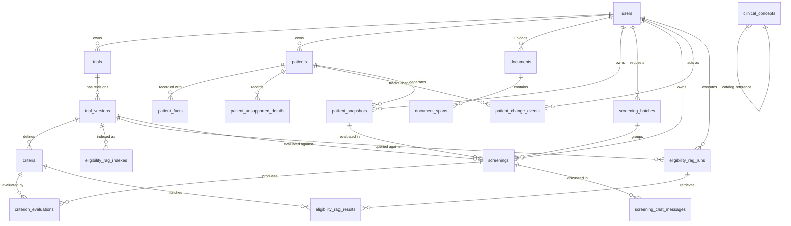

# TrialSync Database Schema and Architecture Report

## 1. Executive Summary & Architectural Invariants

TrialSync is a clinical trial patient matching system built on **Java 21, Spring Boot 3.3, and PostgreSQL 17**, with a modern **React 19 + TypeScript + Vite** frontend. 

The database design reflects two **cardinal invariants**:
1. **Deterministic Eligibility & Immutability**: Eligibility decisions (`potentially_eligible`, `likely_ineligible`, `needs_review`) are generated by a deterministic rule engine—never by an LLM. Once a screening is executed, its evidence base must be permanent and reproducible. Screenings evaluate an **immutable patient snapshot** against a **frozen approved trial version**. Even if the live patient record or draft protocol is edited or deleted, the past screening outcome and criterion evaluations remain fully intact.
2. **AI & RAG Isolation**: Google Gemini and local embeddings (`all-MiniLM-L6-v2` via LangChain4j) provide criteria explanation, source text citation, and semantic retrieval over approved trial protocols. The RAG pipeline and chat assistance operate strictly read-only and server-side; they never alter screening decisions.

The database is managed via Flyway migrations located at `sp-backend/src/main/resources/db/migration`.

---

## 2. Entity-Relationship Diagram (ERD)



---

## 3. Subsystem Architecture & Domain Clusters

The database comprises **19 entity tables** organized into 7 cohesive functional clusters:

```
┌─────────────────────────────────────────────────────────────────────────────────────────┐
│                                 1. IDENTITY & TENANCY                                   │
│  [users] - Tenant boundary for all entities (owner_id scoping)                          │
└─────────────────────────────────────────────────────────────────────────────────────────┘
        │                                  │                                   │
        ▼                                  ▼                                   ▼
┌───────────────────────┐      ┌─────────────────────────┐      ┌─────────────────────────┐
│   2. INGESTION STAGE  │      │   3. CLINICAL CATALOG   │      │    4. PATIENT DOMAIN    │
│ [documents]           │      │ [clinical_concepts]     │      │ [patients]              │
│ [document_spans]      │      │ (25+ standard concepts) │      │ [patient_facts]         │
│ (Raw text, PDFs, OCR, │      │                         │      │ [patient_unsupported]   │
│  candidate extraction)│      │                         │      │ [patient_change_events] │
└───────────────────────┘      └─────────────────────────┘      └─────────────────────────┘
        │                                                                      │
        │                                                                      ▼
        │                                                       ┌─────────────────────────┐
        │                                                       │ [patient_snapshots]     │
        │                                                       │ (SHA-256 hashed facts)  │
        │                                                       └─────────────────────────┘
        ▼                                                                      │
┌─────────────────────────┐                                                    │
│  5. TRIAL PROTOCOLS     │                                                    │
│ [trials]                │                                                    │
│ [trial_versions]        │                                                    │
│ [criteria]              │                                                    │
└─────────────────────────┘                                                    │
        │             │                                                        │
        │             └─────────────────────────┬──────────────────────────────┘
        ▼                                       ▼
┌─────────────────────────┐         ┌─────────────────────────────────────────────────────┐
│ 7. CRITERIA RAG & RETR  │         │       6. DETERMINISTIC SCREENING & AUDIT TRAIL      │
│ [eligibility_rag_index] │         │ [screening_batches]                                 │
│ [eligibility_rag_runs]  │         │ [screenings]                                        │
│ [eligibility_rag_res]   │         │ [criterion_evaluations]                             │
│ (LangChain4j + Gemini)  │         │ [screening_chat_messages] (Bounded Q&A with context)│
└─────────────────────────┘         └─────────────────────────────────────────────────────┘
```

---

## 4. PostgreSQL Custom Data Types & Enumerations

PostgreSQL custom ENUM and native types enforce domain invariants directly at the database engine level:

| Enum / Type Name | Allowed Values | Usage / Target Columns |
| :--- | :--- | :--- |
| `version_status` | `'draft'`, `'approved'`, `'archived'` | `trial_versions.status` |
| `criterion_kind` | `'inclusion'`, `'exclusion'` | `criteria.kind`, `criterion_evaluations.criterion_kind` |
| `fact_type` | `'condition'`, `'medication'`, `'lab'`, `'vital'`, `'demographic'`, `'observation'` | `clinical_concepts.fact_type`, `patient_facts.fact_type` |
| `fact_assertion` | `'present'`, `'absent'`, `'unknown'` | `patient_facts.assertion` |
| `overall_state` | `'potentially_eligible'`, `'likely_ineligible'`, `'needs_review'` | `screenings.overall_state` |
| `evaluation_result` | `'pass'`, `'fail'`, `'unknown'` | `criterion_evaluations.result` |
| `document_kind` | `'patient'`, `'trial'` | `documents.kind` |
| `document_source_type`| `'pdf'`, `'text'` | `documents.source_type` |
| `document_status` | `'needs_review'`, `'approved'`, `'rejected'` | `documents.status` |

---

## 5. Comprehensive Data Dictionary

### 5.1 Identity & Tenancy

#### `users`
Represents registered system users. Serves as the security and tenancy anchor.
* **Inherits**: `TimestampedEntity` (`created_at`, `updated_at`)
* **Indexes**: Unique on `email`

| Column | Type | Constraints | Description |
| :--- | :--- | :--- | :--- |
| `id` | `UUID` | `PRIMARY KEY` | Unique account identifier (`gen_random_uuid()`) |
| `email` | `VARCHAR(320)` | `NOT NULL, UNIQUE` | User login email address |
| `display_name` | `VARCHAR(100)` | `NOT NULL` | Display name of the user |
| `password_hash` | `VARCHAR(255)` | `NOT NULL` | Secure password hash (PBKDF2) |
| `is_catalog_admin` | `BOOLEAN` | `NOT NULL DEFAULT false` | Role flag for managing clinical concept catalog |
| `created_at` | `TIMESTAMPTZ` | `NOT NULL DEFAULT now()` | Microsecond-accurate creation timestamp |
| `updated_at` | `TIMESTAMPTZ` | `NOT NULL DEFAULT now()` | Microsecond-accurate update timestamp |

---

### 5.2 Document Ingestion & Extraction Review

#### `documents`
Uploaded PDFs or pasted text waiting for human-in-the-loop review.
* **Inherits**: `TimestampedEntity`
* **Foreign Keys**: `owner_id -> users(id) ON DELETE CASCADE`

| Column | Type | Constraints | Description |
| :--- | :--- | :--- | :--- |
| `id` | `UUID` | `PRIMARY KEY` | Document identifier |
| `owner_id` | `UUID` | `NOT NULL, FK` | User owner |
| `kind` | `document_kind` | `NOT NULL` | Target domain (`patient` or `trial`) |
| `source_type` | `document_source_type` | `NOT NULL` | Upload format (`pdf` or `text`) |
| `status` | `document_status` | `NOT NULL DEFAULT 'needs_review'` | Lifecycle state |
| `filename` | `VARCHAR(255)` | `NULLABLE` | Original uploaded filename |
| `mime_type` | `VARCHAR(100)` | `NOT NULL` | MIME type (e.g. `application/pdf`, `text/plain`) |
| `size_bytes` | `INTEGER` | `NOT NULL` | Byte count |
| `checksum` | `VARCHAR(64)` | `NOT NULL` | SHA-256 hash for deduplication |
| `original_content` | `BYTEA` | `NULLABLE` | Raw bytes of original file for audit verification |
| `source_text` | `TEXT` | `NOT NULL` | Extracted UTF-8 plain text |
| `pages_json` | `JSON` | `NOT NULL` | Page boundaries and page-level metadata |
| `candidates_json`| `JSON` | `NOT NULL` | Extracted clinical candidate facts/criteria |
| `warnings_json` | `JSON` | `NOT NULL` | Parsing anomalies or missing sections |
| `quality_json` | `JSON` | `NOT NULL` | Text extraction quality / OCR confidence metrics |
| `approved_resource_id` | `UUID` | `NULLABLE` | ID of created `Patient` or `Trial` post-approval |

#### `document_spans`
Precise coordinate offsets linking extracted facts to exact source text locations.
* **Foreign Keys**: `document_id -> documents(id) ON DELETE CASCADE`

| Column | Type | Constraints | Description |
| :--- | :--- | :--- | :--- |
| `id` | `UUID` | `PRIMARY KEY` | Span identifier |
| `document_id` | `UUID` | `NOT NULL, FK` | Parent document |
| `page` | `INTEGER` | `NOT NULL` | Page index (1-based) |
| `start_offset` | `INTEGER` | `NOT NULL` | Character start position within source text |
| `end_offset` | `INTEGER` | `NOT NULL` | Character end position within source text |
| `exact_text` | `TEXT` | `NOT NULL` | Exact substring highlighted in the source document |

---

### 5.3 Clinical Terminology Catalog

#### `clinical_concepts`
The standardized clinical catalog that patient facts and trial criteria bind to.
* **Inherits**: `TimestampedEntity`
* **Seed Data**: Pre-seeded with 25 standard concepts (e.g., `diabetes_type_2`, `creatinine_clearance`, `hba1c`, `hypertension`).

| Column | Type | Constraints | Description |
| :--- | :--- | :--- | :--- |
| `id` | `UUID` | `PRIMARY KEY` | Catalog item identifier |
| `key` | `VARCHAR(80)` | `NOT NULL, UNIQUE` | Unique programmatic concept key (e.g. `age`, `egfr`) |
| `fact_type` | `fact_type` | `NOT NULL` | Clinical domain category |
| `concept` | `VARCHAR(160)` | `NOT NULL` | Canonical clinical concept name |
| `display_label` | `VARCHAR(120)` | `NOT NULL` | Human-readable label for UI |
| `concept_group` | `VARCHAR(24)` | `NOT NULL` | High-level grouping (e.g., `Demographics`, `Labs`) |
| `input_kind` | `VARCHAR(24)` | `NOT NULL` | Value entry mode (`boolean`, `numeric`, `string`) |
| `allowed_assertions_json` | `JSON` | `NOT NULL` | Supported assertions (e.g. `["present", "absent"]`) |
| `fixed_unit` | `VARCHAR(40)` | `NULLABLE` | Required measurement unit (e.g., `mg/dL`, `years`) |
| `effective_date_required` | `BOOLEAN` | `NOT NULL DEFAULT false` | Whether date is mandatory for rule matching |
| `screening_supported` | `BOOLEAN` | `NOT NULL DEFAULT true` | Active in deterministic rule evaluator |
| `help_text` | `VARCHAR(300)` | `NOT NULL` | Clinical guidance displayed to users |
| `terminology_system` | `VARCHAR(32)` | `NULLABLE` | Standard code system (SNOMED, LOINC, RxNorm) |
| `terminology_code` | `VARCHAR(80)` | `NULLABLE` | Code within the ontology system |
| `display_order` | `INTEGER` | `NOT NULL` | Sort order in data entry forms |
| `active` | `BOOLEAN` | `NOT NULL DEFAULT true` | Availability toggle |

---

### 5.4 Patient Records & Historical Snapshots

#### `patients`
Mutable patient record representing a synthetic individual.
* **Inherits**: `TimestampedEntity`
* **Foreign Keys**: `owner_id -> users(id) ON DELETE CASCADE`
* **Constraints**: `ck_patients_biological_sex CHECK (sex IN ('male', 'female'))`

| Column | Type | Constraints | Description |
| :--- | :--- | :--- | :--- |
| `id` | `UUID` | `PRIMARY KEY` | Patient identifier |
| `owner_id` | `UUID` | `NOT NULL, FK` | Owning user |
| `external_id` | `VARCHAR(64)` | `NOT NULL` | User/system synthetic patient MRN/code |
| `display_name` | `VARCHAR(120)` | `NOT NULL` | Patient full display name |
| `date_of_birth` | `DATE` | `NULLABLE` | Patient birth date |
| `sex` | `VARCHAR(32)` | `NULLABLE` | Biological sex (`male`, `female`) |

#### `patient_facts`
Discrete clinical facts associated with a patient.
* **Inherits**: `TimestampedEntity`
* **Foreign Keys**: `patient_id -> patients(id) ON DELETE CASCADE`
* **Soft-Deletion Pattern**: Never hard-deleted; rows are voided via `voided_at`, `void_reason`, and `voided_by_id`. The application filters active facts using `@SQLRestriction("voided_at is null")`.

| Column | Type | Constraints | Description |
| :--- | :--- | :--- | :--- |
| `id` | `UUID` | `PRIMARY KEY` | Fact identifier |
| `patient_id` | `UUID` | `NOT NULL, FK` | Associated patient |
| `fact_type` | `fact_type` | `NOT NULL` | Category of clinical datum |
| `concept` | `VARCHAR(160)` | `NOT NULL` | Concept key matching `clinical_concepts.key` |
| `value_numeric` | `NUMERIC(18,6)` | `NULLABLE` | Quantitative value (e.g. `6.5`, `120.0`) |
| `value_text` | `VARCHAR(500)` | `NULLABLE` | Categorical or textual value |
| `unit` | `VARCHAR(40)` | `NULLABLE` | Standard measurement unit |
| `assertion` | `fact_assertion`| `NOT NULL DEFAULT 'present'` | Assertion state (`present`, `absent`, `unknown`) |
| `effective_date` | `DATE` | `NULLABLE` | Date when observation/condition occurred |
| `source_label` | `VARCHAR(120)` | `NOT NULL DEFAULT 'Manual entry'` | Provenance / source note |
| `voided_at` | `TIMESTAMPTZ` | `NULLABLE` | Timestamp when invalidated |
| `void_reason` | `VARCHAR(500)` | `NULLABLE` | Audit rationale for voiding |
| `voided_by_id` | `UUID` | `NULLABLE` | User who voided the fact |

#### `patient_unsupported_details`
Details extracted or recorded that cannot currently participate in deterministic screening.
* **Inherits**: `TimestampedEntity`
* **Foreign Keys**: `patient_id -> patients(id) ON DELETE CASCADE`
* **Constraints**: `CHECK (category IN ('condition', 'medication', 'observation', 'other'))`

| Column | Type | Constraints | Description |
| :--- | :--- | :--- | :--- |
| `id` | `UUID` | `PRIMARY KEY` | Unsupported detail identifier |
| `patient_id` | `UUID` | `NOT NULL, FK` | Associated patient |
| `category` | `VARCHAR(24)` | `NOT NULL` | Clinical category |
| `label` | `VARCHAR(160)` | `NOT NULL` | Free text clinical label |
| `context` | `VARCHAR(500)` | `NULLABLE` | Extracted clinical context or qualifiers |
| `source_label` | `VARCHAR(120)` | `NOT NULL` | Origin label |

#### `patient_change_events`
Append-only audit ledger recording every mutation to a patient's data.
* **Foreign Keys**: `patient_id -> patients(id) ON DELETE CASCADE`, `actor_id -> users(id)`

| Column | Type | Constraints | Description |
| :--- | :--- | :--- | :--- |
| `id` | `UUID` | `PRIMARY KEY` | Event record identifier |
| `patient_id` | `UUID` | `NOT NULL, FK` | Target patient |
| `actor_id` | `UUID` | `NOT NULL, FK` | User performing modification |
| `event_type` | `VARCHAR(32)` | `NOT NULL` | Action code (`create`, `update`, `void`, `restore`) |
| `entity_type` | `VARCHAR(32)` | `NOT NULL` | Sub-entity modified (`patient`, `fact`, `detail`) |
| `entity_id` | `UUID` | `NULLABLE` | Identifier of affected sub-entity |
| `reason` | `VARCHAR(500)` | `NULLABLE` | Audit reason |
| `before_json` | `JSON` | `NULLABLE` | State before modification |
| `after_json` | `JSON` | `NULLABLE` | State after modification |
| `created_at` | `TIMESTAMPTZ` | `NOT NULL DEFAULT now()` | Event log timestamp (immutable) |

#### `patient_snapshots`
Frozen, immutable state of a patient used as input to a screening run.
* **Inherits**: `TimestampedEntity`
* **Foreign Keys**: `owner_id -> users(id) ON DELETE CASCADE`, `patient_id -> patients(id) ON DELETE SET NULL`
* **Unique Key**: `(patient_id, content_hash)` ensures identical fact combinations reuse existing snapshots.

| Column | Type | Constraints | Description |
| :--- | :--- | :--- | :--- |
| `id` | `UUID` | `PRIMARY KEY` | Snapshot identifier |
| `owner_id` | `UUID` | `NOT NULL, FK` | Owning user |
| `patient_id` | `UUID` | `NULLABLE, FK` | Reference to mutable patient (`SET NULL` on deletion) |
| `content_hash` | `VARCHAR(64)` | `NOT NULL` | Canonical SHA-256 hash of facts and demographics |
| `snapshot_version`| `VARCHAR(64)` | `NOT NULL` | Version identifier (set to content hash) |
| `date_of_birth` | `DATE` | `NULLABLE` | Frozen date of birth |
| `facts_json` | `JSON` | `NOT NULL` | Frozen JSON array of patient facts |
| `source_summary` | `JSON` | `NOT NULL` | Summary of evidence sources |

---

### 5.5 Trial Protocols & Eligibility Criteria

#### `trials`
Clinical trial protocol metadata.
* **Inherits**: `TimestampedEntity`
* **Foreign Keys**: `owner_id -> users(id) ON DELETE CASCADE`

| Column | Type | Constraints | Description |
| :--- | :--- | :--- | :--- |
| `id` | `UUID` | `PRIMARY KEY` | Trial identifier |
| `owner_id` | `UUID` | `NOT NULL, FK` | Protocol owner |
| `registry_id` | `VARCHAR(64)` | `NOT NULL` | Clinical trial registry ID (e.g., `NCT02054715`) |
| `title` | `VARCHAR(240)` | `NOT NULL` | Official trial protocol title |
| `condition` | `VARCHAR(160)` | `NOT NULL` | Target medical condition/disease |
| `phase` | `VARCHAR(40)` | `NULLABLE` | Trial phase (e.g. `Phase 2`, `Phase 3`) |

#### `trial_versions`
Revision-controlled versions of a trial's eligibility criteria.
* **Inherits**: `TimestampedEntity`
* **Foreign Keys**: `trial_id -> trials(id) ON DELETE CASCADE`
* **Lifecycle Rules**: When `status = 'approved'`, the version is permanently frozen. Screenings foreign-key reference approved versions with `ON DELETE RESTRICT`.

| Column | Type | Constraints | Description |
| :--- | :--- | :--- | :--- |
| `id` | `UUID` | `PRIMARY KEY` | Trial version identifier |
| `trial_id` | `UUID` | `NOT NULL, FK` | Parent trial |
| `version` | `INTEGER` | `NOT NULL` | Sequential version number (`1`, `2`, ...) |
| `status` | `version_status` | `NOT NULL DEFAULT 'draft'` | `'draft'`, `'approved'`, `'archived'` |
| `source_text` | `TEXT` | `NULLABLE` | Raw criteria protocol section text |

#### `criteria`
Individual eligibility rules belonging to a specific trial version.
* **Inherits**: `TimestampedEntity`
* **Foreign Keys**: `trial_version_id -> trial_versions(id) ON DELETE CASCADE`

| Column | Type | Constraints | Description |
| :--- | :--- | :--- | :--- |
| `id` | `UUID` | `PRIMARY KEY` | Criterion identifier |
| `trial_version_id`| `UUID` | `NOT NULL, FK` | Associated trial revision |
| `kind` | `criterion_kind` | `NOT NULL` | Rule polarity: `'inclusion'` or `'exclusion'` |
| `"order"` | `INTEGER` | `NOT NULL` | Evaluation display sequence (quoted identifier) |
| `source_text` | `TEXT` | `NOT NULL` | Original protocol requirement text |
| `normalized_rule`| `JSON` | `NULLABLE` | Deterministic DSL rule expression (AST) |
| `required` | `BOOLEAN` | `NOT NULL DEFAULT true` | Mandatory requirement vs. informational check |

---

### 5.6 Deterministic Screening Engine & Audit Trail

#### `screening_batches`
Grouping container for multiple simultaneous patient-trial pair screenings.
* **Inherits**: `TimestampedEntity`
* **Foreign Keys**: `owner_id -> users(id) ON DELETE CASCADE`

| Column | Type | Constraints | Description |
| :--- | :--- | :--- | :--- |
| `id` | `UUID` | `PRIMARY KEY` | Batch identifier |
| `owner_id` | `UUID` | `NOT NULL, FK` | Owning user |
| `label` | `VARCHAR(120)` | `NULLABLE` | User-assigned label for the batch |
| `pair_count` | `INTEGER` | `NOT NULL` | Count of patient-trial evaluations executed |

#### `screenings`
Authoritative outcome of screening one immutable patient snapshot against an approved trial version.
* **Inherits**: `TimestampedEntity`
* **Foreign Keys**: 
  - `owner_id -> users(id)`
  - `batch_id -> screening_batches(id) ON DELETE SET NULL`
  - `patient_snapshot_id -> patient_snapshots(id) ON DELETE RESTRICT`
  - `trial_version_id -> trial_versions(id) ON DELETE RESTRICT`
* **Denormalization Guarantee**: Trial title, registry ID, and version number are copied directly into `screenings` at write time to ensure reports never change even if trial metadata is later revised.

| Column | Type | Constraints | Description |
| :--- | :--- | :--- | :--- |
| `id` | `UUID` | `PRIMARY KEY` | Screening execution identifier |
| `owner_id` | `UUID` | `NOT NULL, FK` | User owner |
| `batch_id` | `UUID` | `NULLABLE, FK` | Associated batch run |
| `patient_snapshot_id` | `UUID` | `NOT NULL, FK` | Immutable patient evidence base |
| `trial_version_id` | `UUID` | `NOT NULL, FK` | Approved criteria revision evaluated |
| `trial_registry_id` | `VARCHAR(64)` | `NOT NULL` | Protocol registry ID snapshot |
| `trial_title` | `VARCHAR(240)` | `NOT NULL` | Protocol title snapshot |
| `trial_version_number`| `INTEGER` | `NOT NULL` | Trial version number snapshot |
| `overall_state` | `overall_state` | `NOT NULL` | `'potentially_eligible'`, `'likely_ineligible'`, `'needs_review'` |
| `screening_date` | `DATE` | `NOT NULL` | Execution date |
| `engine_version` | `VARCHAR(40)` | `NOT NULL` | Engine software version (e.g. `v1.0.0`) |
| `dsl_version` | `VARCHAR(20)` | `NOT NULL` | Rule DSL syntax specification version |
| `terminology_version` | `VARCHAR(40)` | `NOT NULL` | Terminology mapping table version |
| `unit_version` | `VARCHAR(40)` | `NOT NULL` | Unit conversion table version |

#### `criterion_evaluations`
Fine-grained deterministic decision for each individual criterion.
* **Inherits**: `TimestampedEntity`
* **Foreign Keys**:
  - `screening_id -> screenings(id) ON DELETE CASCADE`
  - `criterion_id -> criteria(id) ON DELETE RESTRICT`

| Column | Type | Constraints | Description |
| :--- | :--- | :--- | :--- |
| `id` | `UUID` | `PRIMARY KEY` | Evaluation identifier |
| `screening_id` | `UUID` | `NOT NULL, FK` | Parent screening |
| `criterion_id` | `UUID` | `NOT NULL, FK` | Criterion evaluated |
| `criterion_order` | `INTEGER` | `NOT NULL` | Order evaluated |
| `criterion_kind` | `criterion_kind` | `NOT NULL` | `'inclusion'` or `'exclusion'` |
| `criterion_source_text`| `TEXT` | `NOT NULL` | Criterion source text snapshot |
| `result` | `evaluation_result` | `NOT NULL` | `'pass'`, `'fail'`, or `'unknown'` |
| `truth` | `VARCHAR(16)` | `NOT NULL` | Boolean logic truth evaluation (`TRUE`, `FALSE`, `UNKNOWN`) |
| `reason_code` | `VARCHAR(64)` | `NOT NULL` | Rule engine reason code |
| `canonical_explanation`| `TEXT` | `NOT NULL` | Server-generated deterministic explanation |
| `evidence_json` | `JSON` | `NOT NULL` | Array of clinical facts that proved the criterion |
| `rejected_evidence_json`| `JSON` | `NOT NULL` | Facts considered but rejected (e.g. date out of range) |
| `missing_information_json`| `JSON` | `NOT NULL` | Facts required to resolve an `unknown` outcome |

#### `screening_chat_messages`
Bounded, single-screening conversational assistant turns.
* **Foreign Keys**: `screening_id -> screenings(id) ON DELETE CASCADE`
* **Constraints**: 
  - `CHECK (role IN ('user', 'assistant'))`
  - `CHECK (answer_state IS NULL OR answer_state IN ('supported', 'insufficient_evidence', 'refused'))`

| Column | Type | Constraints | Description |
| :--- | :--- | :--- | :--- |
| `id` | `UUID` | `PRIMARY KEY` | Message turn identifier |
| `screening_id` | `UUID` | `NOT NULL, FK` | Associated screening |
| `role` | `VARCHAR(16)` | `NOT NULL` | Speaker role: `'user'` or `'assistant'` |
| `content` | `TEXT` | `NOT NULL` | Turn message body |
| `answer_state` | `VARCHAR(32)` | `NULLABLE` | Assistant status (`supported`, `insufficient_evidence`, `refused`) |
| `citations_json` | `JSON` | `NOT NULL DEFAULT '[]'` | Specific criterion IDs and fact citations |
| `provider` | `VARCHAR(40)` | `NULLABLE` | LLM service provider (`google-gemini`, `groq`) |
| `model_id` | `VARCHAR(120)` | `NULLABLE` | Model version (`gemini-1.5-flash`) |
| `prompt_version` | `VARCHAR(40)` | `NULLABLE` | Versioned system prompt identifier |
| `created_at` | `TIMESTAMPTZ` | `NOT NULL DEFAULT now()` | Message timestamp |

---

### 5.7 Semantic Criteria RAG Engine (LangChain4j + Gemini)

#### `eligibility_rag_indexes`
Vector store indexing state for approved trial versions.
* **Inherits**: `TimestampedEntity`
* **Foreign Keys**: `trial_version_id -> trial_versions(id) ON DELETE CASCADE`
* **Unique Key**: `(trial_version_id, index_version)`

| Column | Type | Constraints | Description |
| :--- | :--- | :--- | :--- |
| `id` | `UUID` | `PRIMARY KEY` | Index tracking identifier |
| `trial_version_id` | `UUID` | `NOT NULL, FK` | Approved protocol version indexed |
| `corpus_checksum` | `VARCHAR(64)` | `NOT NULL` | SHA-256 hash of criteria chunks indexed |
| `chunk_count` | `INTEGER` | `NOT NULL DEFAULT 0` | Total vectorized criteria chunks |
| `index_version` | `VARCHAR(32)` | `NOT NULL DEFAULT 'v1'` | In-memory index schema version |
| `embedding_model` | `VARCHAR(64)` | `NOT NULL DEFAULT 'all-minilm-l6-v2'` | Local embedding model name |
| `status` | `VARCHAR(32)` | `NOT NULL DEFAULT 'INDEXED'` | State: `'INDEXING'`, `'INDEXED'`, `'FAILED'` |
| `indexed_at` | `TIMESTAMPTZ` | `NOT NULL DEFAULT now()` | Index completion timestamp |

#### `eligibility_rag_runs`
Records of semantic search and explanation queries against a protocol's criteria.
* **Inherits**: `TimestampedEntity`
* **Foreign Keys**: `trial_version_id -> trial_versions(id) ON DELETE CASCADE`, `owner_id -> users(id) ON DELETE SET NULL`

| Column | Type | Constraints | Description |
| :--- | :--- | :--- | :--- |
| `id` | `UUID` | `PRIMARY KEY` | Query run identifier |
| `trial_version_id` | `UUID` | `NOT NULL, FK` | Target trial version |
| `owner_id` | `UUID` | `NULLABLE, FK` | Querying user |
| `query_text` | `TEXT` | `NOT NULL` | Natural language inquiry |
| `run_type` | `VARCHAR(32)` | `NOT NULL DEFAULT 'EXPLAIN'` | Mode: `'SEARCH'`, `'EXPLAIN'` |
| `model` | `VARCHAR(64)` | `NULLABLE` | Explanation model (`gemini-1.5-flash`) |
| `status` | `VARCHAR(32)` | `NOT NULL DEFAULT 'COMPLETED'` | Execution status |
| `insufficient_evidence` | `BOOLEAN` | `NOT NULL DEFAULT false` | Whether query lacked matching criteria |
| `summary_text` | `TEXT` | `NULLABLE` | Generated synthetic explanation |
| `latency_ms` | `BIGINT` | `NULLABLE` | Execution duration in milliseconds |

#### `eligibility_rag_results`
Individual criterion matches returned by vector similarity retrieval.
* **Inherits**: `TimestampedEntity`
* **Foreign Keys**: 
  - `rag_run_id -> eligibility_rag_runs(id) ON DELETE CASCADE`
  - `criterion_id -> criteria(id) ON DELETE SET NULL`

| Column | Type | Constraints | Description |
| :--- | :--- | :--- | :--- |
| `id` | `UUID` | `PRIMARY KEY` | Result item identifier |
| `rag_run_id` | `UUID` | `NOT NULL, FK` | Parent RAG run |
| `criterion_id` | `UUID` | `NULLABLE, FK` | Matched criterion |
| `rank` | `INTEGER` | `NOT NULL` | Similarity ranking (1-based) |
| `similarity_score` | `DOUBLE PRECISION`| `NOT NULL DEFAULT 0.0` | Cosine similarity score |
| `criterion_kind` | `VARCHAR(64)` | `NULLABLE` | Inclusion or exclusion |
| `source_text` | `TEXT` | `NOT NULL` | Original text retrieved |
| `explanation` | `TEXT` | `NULLABLE` | Model clarification of relevance |
| `citation` | `VARCHAR(255)` | `NULLABLE` | Section citation reference |
| `provenance_valid` | `BOOLEAN` | `NOT NULL DEFAULT true` | Confirmed match against canonical criterion |

---

## 6. Key Architectural Guarantees & Implementation Patterns

### 6.1 Immutability via Snapshotting & Content Hashing
A core failure mode of naive clinical trial matching systems is updating a patient's lab value or updating a protocol, which silently invalidates historical screening results. TrialSync guarantees total auditability:
- **`patient_snapshots`**: The snapshot computes a canonical SHA-256 hash of all facts. If an unchanged patient is re-screened, the existing snapshot row is reused. If the patient record changes, a new snapshot is created.
- **`ON DELETE SET NULL` vs `ON DELETE RESTRICT`**:
  - If a mutable `patients` row is deleted, `patient_snapshots.patient_id` is set to `NULL`, but the snapshot and its screenings remain intact.
  - In contrast, `trial_versions` and `criteria` cannot be deleted if a completed screening cites them (`ON DELETE RESTRICT`).

### 6.2 Three-Valued Logic (`pass` / `fail` / `unknown`)
Missing clinical evidence is a first-class citizen:
- Inclusion criteria: Evaluated as `pass` only if verified `TRUE`.
- Exclusion criteria: Evaluated as `pass` only if verified `FALSE`.
- Missing or ambiguous evidence returns `unknown`.
- Overall State:
  - If **any required criterion** evaluates to `fail` $\rightarrow$ `likely_ineligible`.
  - If **all required criteria** evaluate to `pass` $\rightarrow$ `potentially_eligible`.
  - If no criterion fails but one or more are unknown $\rightarrow$ `needs_review`.

### 6.3 Query Optimization & Batch Fetching
To prevent the classic ORM $N+1$ query problem across nested clinical structures:
- Hibernate batching `@BatchSize(size = 100)` is declared on all lazy collections (`versions`, `criteria`, `facts`, `evaluations`, `chatMessages`, `snapshots`).
- Composite B-Tree indexes cover tenant lookups (`ix_..._owner_id`), snapshot lookups, and evaluation sorting (`(screening_id, criterion_order)`).

---

## 7. Migration History & Cleanups

| Migration Script | Status | Purpose |
| :--- | :--- | :--- |
| `V20260802_0014__java_baseline_marker.sql` | Applied | Advances Flyway head to Java-owned migration space; baselines Alembic v12 schema. |
| `V20260802_0015__research_database_foundation.sql` | Obsolete/Dropped | Initial research trial tables (participants, dose events, outcomes). |
| `V20260802_0016__eligibility_rag.sql` | Applied | Creates `eligibility_rag_indexes`, `eligibility_rag_runs`, `eligibility_rag_results`. |
| `V20260802_0017__cleanup_legacy_research_and_alembic.sql` | Applied | Drops obsolete legacy research ML tables and Alembic tracking; retains clean, focused matching schema. |

---

## 8. Summary File Link

This comprehensive report is stored directly in the repository at:
- [`docs/DATABASE_ARCHITECTURE.md`](file:///d:/PROJECT/TrialSync/docs/DATABASE_ARCHITECTURE.md)
